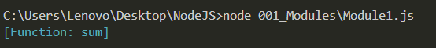
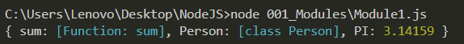
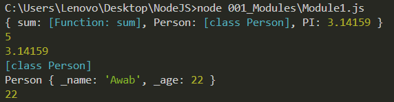
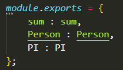

## Modules:
- A Node Module is Simply a JS File. It's a way to separate concerns throughout
our application instead of having it all inside one file. 
- For example, imagine in some `Module1.js` file we have a bunch of Math Functions, API Requests, and Database Calls. 
- Instead of putting them all in one file, we could separate each of these concerns into their own file: One for Math Functions, One for API Requests, and one for Database Calls. That makes the code more tidy and manageable. 

### Explained Example:
- We have this `sum` function in `Module2.js`. Now, let's say that we want to exxpose it to the world so that any module that wants to use it, such as `Module1.js`, may simply Import it and use it right away instead of having to implement it from scratch. How do we do this?

#### Importing & Exporting a Function:
- What we can do is go to `Module2.js` and write `module.exports = sum;`
- This makes the `sum` function available as one of the exports of `Module2.js`.
- Now, we need to tell `Module1.js` where this `sum` function is located. 
- To do this, we must declare a variable (`Module2Tools`) that points to `Module1.js` and through this `Module2Tools` variable, we may access everything that `Module2.js` makes available through its declared exports.
- We define this variable through `const Module2Tools = require('./Module2.js')`
- FYI: By Printing out the contents of the required variable, we can actually see everything that its module exports and makes available to us:

- Since `Module2Tools` here is nothing but the function received from `Module2.js` (The `module.exports` object was set directly to be equal to nothing but the function `sum`), then using `Module2Tools` directly is like using the `sum` function from `Module2.js` directly.
- So, we can actually call `console.log(Module2Tools(1,4))` and it will print out (5).

#### Importing and Exporting Multiple Things:
- Now, let's say you want to import multiple functions, variables, or even a class. How do we do that? Let's create a const `PI` and a class `Person` in `Module2.js`. There are actually multiple ways to do this:

##### Adding Multiple Properties to the `module.exports` Object:
- You could give the `module.exports` object of your `Module2.js` module multiple properties, each of which referring to a certain variable/function/class that you
would like other modules to access with these same names:
 -  `module.exports.sum = sum`
 -  `module.exports.Person = Person`
 -  `module.exports.PI = PI`
- When other modules such as `Module1.js` require from `Module.js`, since the `module.exports` object of `Module2.js` now holds multiple items instead of referring to a single function, you will access `Module2Tools` as an object through dot notation to access these items. Here's what happens when you `console.log(Module2Tools)` out now. It tells you that it's an entire object, not a function, which means that you must also access it like any other object:

- Now, whenever you want to access the individual items imported from `Module2.js`, you use dot notation as such:
  - `console.log(Module2Tools.sum(1, 4));`
  - `console.log(Module2Tools.PI);`
  - `console.log(Module2Tools.Person);`
  - `Awab = new Module2Tools.Person("Awab", 22);`
  - `console.log(Awab)`
  - `console.log(Awab.getAge());`

- Notice how the `Awab` object is able to immediately access the instance method `getAge()` even without referencing the `Module2Tools` object or the `Person` class.

- One last thing, if the repetitive `module.exports` notation is too ugly for you, the standard is to actually write out `module.exports = {}` as an object literal and write out the key-value pairs of what to export and what it will be called when accessed by the other modules (nameOfItem : Item) pairs.

