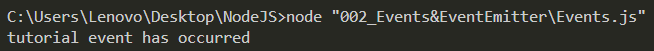
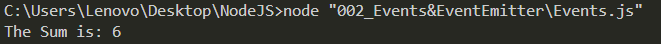
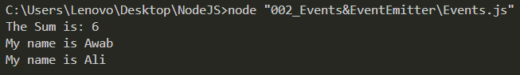

## Events:

- The `Events Module` basically brings "Event-Driven Programming" Into NodeJS. You can require the `EventEmitter` class through `const EventEmitter = require("events")`
- You can then instantiate an object from that class `const eventEmitter = new EventEmitter();` 
- You can then attach an EventListener to this Object using the `on(string, function)` function. This is an incredibly important function. 
  - You firt pass a `string` into the first argument of the function. This `string` is the name of the event that you want this Listener to Listen to. 
  - Note that this event `string` that you pass could be an already-defined event (e.g., `data`, `close`, etc. We'll talk about these later, especially during the discussion of `streams`), or it could be a custom user-defined event (We'll see how to make those in a bit).
  - The second argument is a `function`. This is the function executed whenever that specified (`string`) occurs. 
  - If this specific event that your are listening for produces output data, then most-likely you want your `function` to take in that data as arguments to work with it. If your function defines parameters and the event produces output data, then the listener will automatically pass that data to your function upon the occurrence of the event. This is very important.
  - We haven't discussed this yet, but when taking in streams of data using the `data` event, since data arrives in packets that arrive periodically rather than receiving all of it in one go, your `eventEmitter.on("data", function(packets))` will keep on activating as more and more packets come in and everytime these packets will be passed as arguments to the `function(packets)` which does something with that data. 

- Let's setup our own eventEmitter that listens for the event called `tutorial`. This is a custom event that we're making ourselves. Let's make the `function` simply just print "tutorial event has occurred" when it catches this event:

```
eventEmitter.on("tutorial", () => {
    console.log("tutorial event has occurred");
});
```

- Now, if we run this code, you'll actually notice that it won't output anything; Nothing is going to happen. Why? We setup this object to listen for `tutorial` events, but a `tutorial` event was never actually Emitted during runtime. This object only listens and responds to `tutorial` events, so the function in the Listener's parameters never executed. 
- We can actually emit a `tutorial` event using this line of code:
  `eventEmitter.emit("tutorial");`. Typically, you would have some sort of thing happen, like a Button Click, a Function Call, an object instantiation, etc., that would end up Invoking this `emit("event")` function for your custom-defined events like "tutorial", but for the sake of learning, we'll just manually call it out in the open for no reason to emit the "tutorial" event to see how the `on()` function catches this event and executes its function.
- By the way, notice how the `emit("tutorial)` call comes AFTER the `on("tutorial)"` event listener is defined. The Listener obviously only listens to events occurring after it has been defined. 


- Now, what if we wanted the `function` to have parameters and receieve them from the Emitted Event? Well, we give the function the parameters it needs:
```
eventEmitter.on("tutorial", (num1, num2) => {
  console.log(`The Sum is: ${num1 + num2}`);
});
```
- Then, we make the Emitter itself actually pass output data when the event is emitted: `eventEmitter.emit("tutorial", 4, 2);`


### Custom Event Listener Objects:
- Let's say you want to create your own object which also takes advantage of using events? Currently, we have to use the EventEmitter class itself and its instances in order to emit or listen to events, but what if I wanted to have my own custom object which can also do these things? 
- Well, all you have to do is to make a class that `extends` the `EventEmitter` class, use the `super()` function at the start of the `constructor()`, and then instances of that class will be able to use the `emit()` and `on()` functions as well!
- Checkout the `Person` class defined. Since it `extends EventEmitter`, an instance of `Person` is also an instance of `EventEmitter`, thus it can use its methods. Notice how we call the `on()` and `emit()` methods using the `Awab` object, which is an instance of the `Person` class. 


#### Events Run Synchronously:
- Lastly, after adding another `Person` object (`Ali`), notice the output here:

- The thing to get from this is that Events Run Synchronously. The event that gets Emitted first is the one Executed first. 