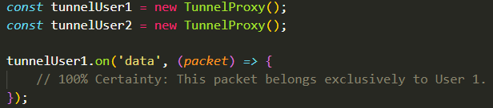
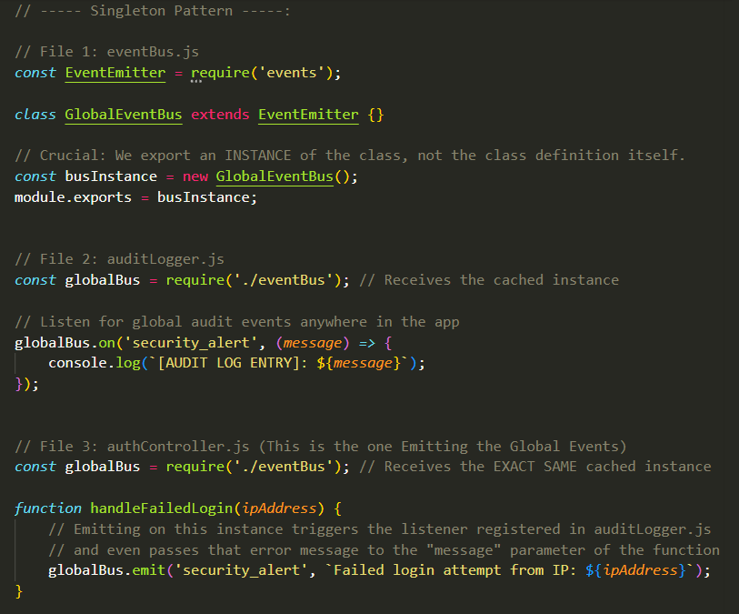
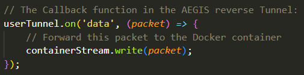
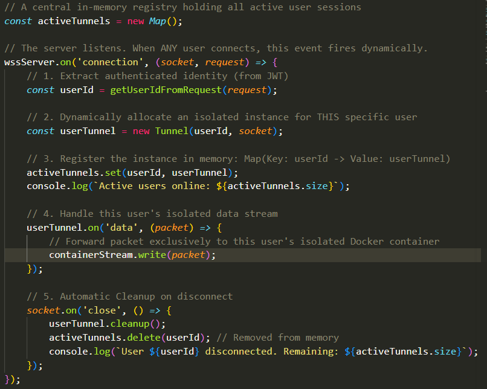

## Callback Functions:
- To introduction some quick terminology, in Javascript, a `callback` function is a function passeed into another function as an argument, which is then executed (or "called back") inside that outer function to complete a specific task. 
- In this context, the `function(..)` in `eventEmitter.on("someEvent", function(..))` is a Callback Function, a Synchronous one at that. 
- Side Note: Relying too heavily on nested asynchronous callbacks can lead to "Callback Hell" (highly nested, unreadable code). Modern Javascript uses "Promises" and "Async/Await" to solve this issue, but more on that later. 

## Emitted Events are Not Global (Importance of Custom Event Listeners):
- An `EventEmitter` is not a global ratio tower broadcasting to the entire server, it works locally. 
- When we instantiated `new Person("Awab")` and `new Person("Ali")`, we allocated two completely separate blocks of physical RAM memory.
  - `Awab` has its own internal dictionary of events and listeners.
  - `Ali` has its own dictionary as well, entirely unrelated to `Awab`'s.
- When we execute `Ali.emit("name")`, the V8 engine of NodeJS looks only inside `Ali`'s memory block, sees that `Ali.on("name",function(..))` listener attached to `Ali`, executes that `function`, and stops.
- Even though `Awab` is also listening for the `name` event, the `Awab.on("name", function(..))` listener does not hear that emitting caused by `Ali`. This is why calling `Ali.emit("name")` did not also have the `Awab` object executing its `function(..)` even though `Awab` is also listening for the `name` event.
- The V8 Engine does not check every single EventEmitter object in memory and check if they are also listening for that same `name` event, it only checks the exact object that emitted the event. 

- This is what makes Custom Event Listeners, like the one we made with the `Person` class, so important. 
  - Maybe you want your object that also listens to these events to have certain properties and functionalities specific to your task that the standard EventEmitter class object simply wouldn't have.
  - In the example of AEGIS, the `Tunnel` would need a `data` Listener to listen in to incoming data streams and act upon that, and obviously, there exists many other functionalities that the `Tunnel` must have that simply cannot be done with a standard EventEmitter object. 
  - So, you'd need the `Tunnel` object itself to be the one both emitting and listening in to this `data` event, otherwise the Tunnel object wouldn't be able to listen in to the `data` event.
  - Obviously, this is a bit of a tangent, but you would need a different `Tunnel` object for every single user that initiates an EvidenceGathering. You obviously cannot have all users share a single Tunnel. 
  - A standalone `Tunnel` object for each user would mean that whenever a Packet arrives, say for User1, invoking the `data` event, since that event is only invoked for that specific User1 `Tunnel` object and not all `Tunnel` objects, we would immediately know that this Packet belongs to the EvidenceGathering process of User1, and we wouldn't have to write massive, complex routing statements to figure out where each bit of data belongs and to which user. 
  - For example, look at the code Snippet below, this is how you could set this up:
  
  - This is also nice because if `tunnelUser1` crashes and emits an `error` event, it only tears down User1's capture process. The other users remain completely unaffected because these tunnels are completely distinct. 

### Singleton Pattern (Global EventListener):
- By the way, since an EventListener's `function(..)` only executes whenever that same object Emits the event, if you want an event to be heard "globally", even beyond a single JS module, you're essentially going to have to use a single instance and export that same instance to the other modules. This is called the "Singleton Pattern". Since all of these objects will essentially be the same object (all of them reference the exact same memory block), emitting on it will trigger every listener that's of that exported object across your entire application. 
  

- Why does this matter? Latter when we setup our AEGIS PostgreSQL database connection pool across the different AEGIS Modules, we instantiate the database connection once, export that instance everywhere, and every file uses that exact same authenticated connection. We don't create a new connection pool for every single file.

## How Event Listening and Callback Executing are Different:
- In the 002 Events discussion, we concluded by mentioning that events run asynchronously. However, there is a very important distinction to be made.
- When an EventListener is WAITING for an event to occur, simply listening for that event, that waiting and listening is done completely on the background, and has absolutely no CPU usage, so the V8 main execution thread of NodeJS is not held up by this waiting at all, meaning this execution is ASYNCHRONOUS. 
- However, when an event is emitted and caught, and the callback `function(..)` of the listener is called due to the occurrence of this event, the execution of that function does occur in the main thread and it does execute on the main execution thread, which means all other execution is halted while this function runs SYNCHRONOUSLY.
  - Due to this, you should never have heavy code (like hashing, encrypting, or image rendering) in your callback `function(..)` otherwise each time this event occurs and the callback `function(..)` is called it will heavily clog up the CPU, which is highly un-optimal. 
  - In the context of AEGIS, if you receieve attempt to calculate the SHA-256 hash of the 50MB DOM directly inside the `data` callback, you will paralyze the server.
  - Because the callback is synchronous, V8 will lock the main thread to do the math, and if it takes 2 seconds to hash that one file, the entire event loop gets locked for 2 seconds. Any new packets arriving from other accounts during those 2 seconds will queue up at the OS level (because the program itself won't take them), and eventually the OS will start dropping them, destroying evidence.
  - In a production environment, we would offload the hashing to a "Worker Thread" (a separate CPU thread explicitly for heavy math). Node.js has a built-in    `worker_threads` module specifically designed to spin up a separate V8 isolate on a different CPU core just to do heavy math without blocking the main Event Loop, but more on that later.
  - The neat thing is that in the context of AEGIS, in the reverse tunnel, the callback function for incoming data is probably going to look like this:
    
    This is us taking the incoming packet from the input stream and moving it to the stream (array of arriving packets) of the docker container. Moving a network packet from one stream to another is simple memory pointer arithmetic. This takes a fraction of a second and a SINGULAR modern CPU core can execute hundreds of thousands of these routing callbacks per second. 

### Example of Event Listening and Callback Executing:
#### Stage 1: The waiting being Offloaded to the OS kernel:
- When you write `userTunnel.on('data', function(..))` for 1000 different connected users, NodeJS does NOT keep 1000 Javascript processes running checking if data has arrived. Here's what actually happens:
  - V8 stores the reference to the callback `function(..)` in memory associated with that specific `userTunnel` object of that specific user.
  - `libuv` tells the operating system to notify it when Network Packets are received by the physical netnwork card for any of these 1000 objects.
  - The operating system manages the low-level listening at the hardware level. While waiting, the NodeJS main thread consumes basically 0% of the CPU.

#### Stage 2: The Arrival and Execution being Synchronous on the Main Thread:
- When a burst of packets arrives from the Target Website for User42:
  - The OS receives the bytes, places them in a buffer, and signals to `libuv` that Socket42 has data ready to be read.
  - In the Poll Phase of the Main Loop, `libuv` wraps those raw bytes into a NodeJS `Buffer` object and pushes User42's `data` callback into the Poll Queue.
  - The single JavaScript main thread pulls User4s's callback from the Queue and executes it SYNCHRONOUSLY from start to finish.
  - If the callback simply passes the `Buffer` to the container (`containerStream.write(packet))`, this transfer takes microseconds.
  (Note: that `packet` is a `Buffer`. It is raw binary "hexadecimal". It is not text nor JSON. When you start writing the WebSocket tunnel, you will be passing these raw memory Buffers directly back and forth.)
  - While this is happening, maybe User87 initiated an EvidenceGathering process and therefore his packets are starting to get sent to the Server, but since the JavaScript program is busy with the transfer of User42's data, those Packets are being put into a Queue at the OS-Level.
  - However, since the execution of User42's callback is extremely easy and short (literal microseconds), this doesn't cause any problems whatsoever as the server can execute that callback millions of times a second.
  - As soon as User42's callback finishes, the main thread pulls the next callback from the queue (e.g., User87's) and executes that one Synchronously.

- The important thing to remember is that:
 - Waiting for I/O is multi-threaded, asynchronous, and handled by the kernel/`libuv`
 - Callback execution is single-threaded, synchronous, and runs on the main V8 thread.
 - As long as your synchronous callback only handles lightweight tasks rather than computationally heavy algorithms, the main thread clears thousands of callbacks per second with no discernible latency. 

## How Multiple Users are Handled In EventListeners:
- We've already hinted at this before, but whenever you have multiple users initiating this EvidenceGathering problem at the same time, you'll have an influx of packets of different evidence from different users hitting the server at the same time. At that point, how does the server determine which packet belongs to who? And how does our code take care of all of that routing? 
- Not only that, but when creating a `Tunnel` object for each user, how exactly do we dynamically create these objects on the fly without guessing the number of users? From our previous code snippet, it looks like we're manually creating `UserTunnel1` and `UserTunnel2`objects; Surely we won't just guess the number of users and hardcode a specific number of objects to run at a time, right? 

### How We Manage The Routing Of Packets From Multiple Users Simultaneously:
- Again, as previously discussed, if an object `UserTunnel1` with a specific memory location in RAM emits some event `data`, then ONLY that same object `UserTunnel1` will have its corresponding listener `UserTunnel1.on("data", function(..))` actually get invoked and its callback `function(..)` executed on that `data` event because `UserTunnel` is the one that emitted that event. 
- Any other object residing on a different memory location, even if from the same `Tunnel` class, even if it has a listener that listens to that same `data` event, will not have its corresponding listener `UserTunnel2.on("data", function(..))` invoked, and therefore its callback function will NOT be executed. 

  - So, a standalone `Tunnel` object for each user would mean that whenever a Packet arrives, say for User1, invoking the `data` event, since that event is only invoked for that specific `UserTunnel1` object and not all `Tunnel` objects, we would immediately know that this Packet belongs to the EvidenceGathering process of User1, and we wouldn't have to write massive, complex routing statements to figure out where each bit of data belongs and to which user. 
  - For example, look at the code Snippet below, this is how you could set this up:
  
  - This is also nice because if `tunnelUser1` crashes and emits an `error` event, it only tears down User1's capture process. The other users remain completely unaffected because these tunnels are completely distinct. 

### How We Create Tunnel Objects For Multiple Users On The Fly:
 - On a production level, user management is REACTIVE & EVENT-DRIVEN. You maintain a Javascript `Map` object containing key-value pairs and you dynamically instantiate an object only when an incoming network connection physically occurs and is accepted (through JWT).

- Here's the Lifecycle in Production:
 - The Server runs a single event listener, just one, that waits for incoming connections: `wss.on("connection", (socket) => {. . .})`
 - When a user connects (and the JWT is validated), the operating system triggers the callback of that connection listener, and inside the callback function, we dynamically instantiate a new `Tunnel` object specifically for that user.
 - We store this `Tunnel` instance inside the central `Map` using the user's unique ID (useID extracted from their validated JWT) as the key: `(userID, Tunnel)` pairs.
 - When the user finishes the capture or drops their network connection, the socket's `close` event fires. You delete the user from the `Map`, which destroys the object and allows the V8 garbage collector to free the RAM.
 - If 1 user connects, activeTunnels has a size of 1. If 1000 users connect, 1000 independent instances exist in activeTunnels. Each instance maintains its own scope and event listeners without interfering with the others.

- Checkout the Corresponding Code-Snippet in the AEGIS_Events_Snippet.js file for a demonstration of this:

