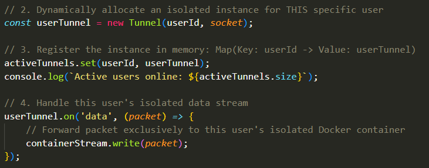
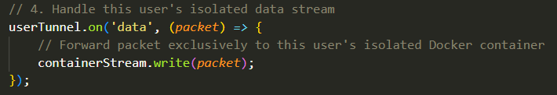
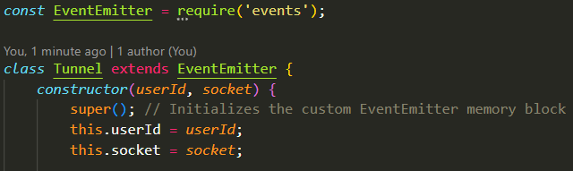
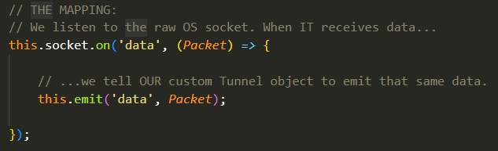
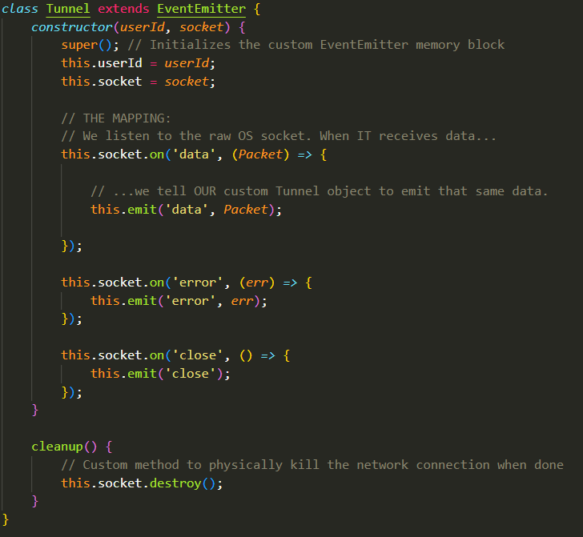
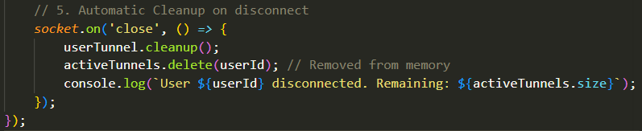
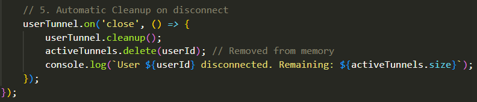

- Note: Read the `AEGIS_Events.md` file before this one.

## Why This File Exists:
- This whole discussion exists because there was a lot of ambiguity left in the previous code shown in the `AEGIS_Events.md` file. More specifically, this code block when we discussed Multiple Users:

## What is a Socket?
- As you already know, a Server has One Physical Network Interface Card (NIC), which is the hardware chip where WIFI connects. That single piece of hardware receives every single piece of data (Packet) meant for the server. 

- You also already know that a for a successful network connection over the internet requires each packet traveling over the internet to contain these four peices of information, take it as a 4-tuple:
  - 1: Source IP Address (IP Address of User Machine Initiated Gathering Process)
  - 2: Source Port (The Port of the Electron Application Running on the User Machine)
  - 3: Destination IP Address (IP Address of the AEGIS Server)
  - 4: Destination Port (Since the Server is receiving HTTP requests, this would be port 443).

- Obviously, as you know, the IP address is required to identify to which machine over the internet is this data meant? and the Port is required to identify to which specific application within that machine is this data meant? an IP alone is not enough because multiple applications in the machine could be anticipating data at the same time, you need to know to which application each data belongs.
- These pieces of data are present in the headers of each packet transmitted over the internet.

- If 10,000 users connect to the AEGIS server, all 10,000 of them are connecting to Destination Port 443 in our server, and all of them are obviously connecting to the same IP address of our server, which means that the 4-tuple for all of them looks like this:
  - 1: AEGIS Server IP (Destination IP)
  - 2: 443 (Destination Port)
  - 3: Source IP (The User Machine's IP Address)
  - 4: Source Port (A random temporary port chosen by the User's OS for the Electron App, say 51234).

- So, if the OS only looked at the destination port, it would be impossible to tell all the packets apart as they're all going into the same 443 port. So, how does the OS separate the data? Here's the thing, we have these things called "Sockets". Here's how the Hierarchy goes:

  - The Port: A port is a 16-bit number (from 1 to 65,535) attached to a Packet's header. It acts as an apartment number. The server's IP Address gets the data to the building (The NIC), and the port tells the OS which specific application (apartment) is supposed to receieve it.
  - The Socket: A Socket is a Data Structure (not like a full collection, but a single object) inside the Operating System Kernel memory that represents a specific, active, end-to-end conversation between two machines.
    - When two machines communicate over the internet, they do so over a Socket. Both machines allocate a memory block in their OS Kernel called a Socket, and whenever the machine on the other end sends you data, it sends it through that specific Socket. A Socket is only between the two machines, nobody else. So, even though multiple machines could send to the same port, each one sends to its own allocated Socket
  - The File Descriptor (fd): The OS Kernel stores all of these active Sockets in a giant array. The File Descriptor is an integer, it's the index number pointing to where that socket lives in the kernel's RAM. So, you use the File Descriptor as an index to tell you where in the Array a specific Socket is. 
    - When a packet hits the physical NIC, the kernel reads the header. It sees `User IP + Port 51234 -> Server IP + Port 443`. The kernel searches its internal hash table for that exact 4-tuple. When it finds the match, it identifies the File Descriptor (e.g., fd = 104), puts the data into the socket's kernel bugger, and signals to `libuv` that data has arrived at this specific socket.
    - So, each 4-tuple represents a Socket. That Socket is acquired by taking the 4-tuple, searching the internal hash table for its corresponding file descriptor, and taking that integer as an index for the array of Sockets to find the particular socket represented by that 4-tuple. 
    - Since that Socket is meant only for the communication between the AEGIS Server and a Particular User Machine, there is no ambiguity in who the packets belong to. 

- This whole thing is actually called "Multiplexing" where you have multiple distinct streams flowing into the same port, with each stream having its own Socket and File Descriptor that directly corresponds to each distinct 4-tuple, to remove any ambiguity in the routing of packets throughout these different streams.

## The JavaScript Socket Object: 
- There exists this code snippet from the code we've previously shown:

- What is wssServer? It's not a custom object whose class we wrote from scratch, it's an instance of the WebSocket Server provided by a third-party library like `socket.io` or `ws`, but we're still on the basics of NodeJS now so no need to worry about the exact details of this object.
- What you do need to know however is that this server object `wssServer` inherits from the `EventEmitter` class, and sits on the specific port of `443` and listens. 
 - When a user sends an HTTP upgrade request and the OS completes the TCP handshake, once the handshake is finished, the third-party library generates a `socket` object for that user and emits the `connection` event.
 - What is this `socket` object? What does it contain? Remember how the socket is a data structure in literal kernel memory in an array? the JavaScript `socket` object returned by these third-party libraries when the handshake is completed is a C++ Binding (a reference pointer) to that Socket. So, if you call something like `socket.write(data)` in NodeJS, V8 uses that pointer to tell the OS kernel to transmit the bytes directly from the Socket.

- Additionally, there's this other parameter being received by the listener called `request`. What is this?
 - The `request` object is another object provided by NodeJS whenever a `connection` event is emitted when the Handshake is completed. 
 - The `request` object represents the raw HTTP metadata that the user sent to initiate the Websocket upgrade connection necessary to open the Tunnel.
 - When a user tries to connect to the AEGIS Server, they send an HTTP request asking to upgrade the connection to a WebSocket. This `request` object contains all the HTTP headers, the user's IP address, and even the target URL of the website.
 - The JSON Web Token (JWT) used to validate this connection is a string hidden inside one of those headers in the `request` object. Typically, the client application (That we'll be building through Electron), places the JWT inside the `Authorization` header. So, although this was omitted from the initially shown code, this is how you'd probably extract the JWT in reality:

- So, when a connection is made with the AEGIS server and the Handshake is completed, a `connection` event is emitted by NodeJS itself with two output objects `socket` and `request`, (and any third-party Socket.io or ws object is able to listen to this emitted event as long as it has `connection` as its event)
- So, the line `wssServer.on('connection', (socket, request) => {})` listens to this `connection` event, reacts to every connected user, gathers the outputted `socket` and `request` objects as they will both be incredibly important to us in:
  - The `socket` object is used to actually get the data of the Evidence Gathering process that will be sent from the User to the Socket in the OS Kernel.
  - The `request` object is used to get information about the User and the initial HTTP request itself. It contains the JWT token with the UserID and the Target Website URL. When we create a `Tunnel` for the user before any data is transmitted, we need that `userId` to bind every `socket` object with its corresponding user's ID in the Map Object: (`userId` : `socket`) pairs. 

- Again, this is very important to note, these Third-Party libraries like `Socket.io` were programmed such that if an instance (`wssServer`) of the `Socket.io` class was setup to listen for a `connection` event through `wssServer.on("connection",..)`, it will actually automatically listen to any successful connection made with the server, take in the parameters (`socket` and `request`) resulting from that connection, and have its callback `function(..)` invoked from that `connection` event. This is very unlike other events where you have to, from the same object, both `emit("data")` and `on("data")` the event in order for the listener to actually listen to that even and invoke its callback function. In this case, you don't actually have to `emit("connection")` yourself at all. 

- Another extremely important thing to remember is that the returned `socket` object that you get from an invoked `connection` event is incredibly important as it is a reference to the physical Socket inside the Kernel's Memory. 
 - Since this `socket` object is also a very special type of `EventEmitter` object setup by Third-Party Libraries, it actually can listen in on the Kernel-Level any respond to events happening on the Kernel Memory-Level without any `emit()` calls.
 - More Specifically, a `socket` object will listen to and respond to any `data` event that occurs at the Kernel Memory Location that it is referencing. This means that any incoming packets from the user's EvidenceGathering process that land in that physical Socket will actually immediate invoke the corresponding `socket` object's `data` event and will pass the new incoming data (`packet`) that caused this event to its callback function in the EventListener: `socket.on("data", (packet) => {})`. 
 - You may be wondering, "but I don't see any `socket.on("data", (packet) => {})` in the code. So what's going on here and how are we listening in to the incoming packets?" This will be discussed shortly.

- In the same sense, the `request` object is also a special object, but we mostly only use it to extract the HTTP Request data that established the connection. We don't really attach any listeners to it.

## The Power Of The Socket Objects and The "Tunnel" Class:
- In the following code Snippet from our previously demonstrated code:

- You might be wondering, "Why are we passing the `socket` object to the constructor of each `Tunnel` object?", "What even is the Class Definition for the `Tunnel` class?", or where that `packet` in the `userTunnel.on("data", (packet) => {..})` is coming from?

- One thing incredibly important to understand is that this `Tunnel` class is an "Empty" class. By that we mean that we actually custom-defined this class, it's not a pre-built one. This means that this class doesn't actually know what's going on in the operating system as it's not tied to it whatsoever (Unlike those third-party classes like `Socket.io` which were made to listen in on the OS Kernel-Level). 
- Basically, remember how since the `socket` object is a result of a successful connection (Output of a successful emitting of a "connection" event) and that it is a "special object" that listens in on the Kernel-Level to new incoming packets at that corresponding Physical Socket's Memory Location in the Kernel? How it can, by listening in to the `data` event, not only actually detect every single packet that hits that Physical Socket but also actually obtain that packet and make it available to us for use? 
- Well, the `Tunnel` class is NOT a special class, it's objects are NOT special objects. They cannot do this. We're defining the `Tunnel` class ourselves; It does not have the capability to listen in to incoming data at the Kernel-Level or access it. So, if we define our `Tunnel` class normally and write `UserTunnel.on("data" (packet) => {})`. It won't actually listen in to anything by itself; This same UserTunnel object would have to emit this `data` event itself and pass the `packet` manually: `User.Tunnel.emit("data", packet)` in order for the `UserTunnel.on("data")` EventListener to catch that. So, why on earth do we have this line of code then?

- Wouldn't this mean that we'd have to use the `socket` object itself directly in order to actually sense these incoming packets and receive them? But that would also mean that we lose all access to the special features of our `Tunnel` class that we need for other purposes as we're having to use this special `socket` object exclusively. So, what is actually happening?

### The "Tunnel" Class Definition:
- First of all, as we know, `userId` and `socket` are both passed into the constructor of the `Tunnel` class, the `Tunnel` class will inherit from `EventEmitter`, and it will obviously call `super()` right at the start of the constructor:

- The sole reason we pass the `socket` special object into the constructor of every `Tunnel` object is because we will burn the special properties of the `socket` object directly into each corresponding `Tunnel` object from within the constructor itself.
- Basically, whenever we create a new `Tunnel` object, we want to link it with a `socket` object such that whenever the `socket` object listens in to a new incoming `packet` that just hit the Physical Socket through the `data` event: `this.socket.on("data", (packet) => {})`, our Custom `Tunnel` object itself will emit that same data: `this.emit("data", packet);`: 

- This way, the `socket` object and reacts to every `Packet` that hits the Physical Socket under the `data` event, then activatives its callback function; In that function, it makes the `Tunnel` object itself `emit` the same `data` event and output the same `packet` captured by the `socket` object. After which, the `UserTunnel.on("data", (packet) => {})` call that we previously discussed now listens in to that `data` event, catches that `packet`, and executes its callback.

- Not only that, but when the `socket` object itself gets an `error` event on the OS-Level and listens to it: `this.socket.on("error", (err) => {})`, the `Tunnel` object should also `emit` that same error: `this.emit("error", (err) => {})` so that we can deal with it through the `Tunnel` object directly.
- Additionally, whenever the `socket` closes (connection is over) and emits the `close` event, when it catches that event: `this.socket.on("close", ()=> {})`, the `Tunnel` object should also `emit` that same `close` event: `this.emit("close", ()=>{})` so that we can, from the `Tunnel` object itself, deal with this closing of the connection.
- Furthermore, for the sake of it, imagine we have a `cleanup()` function to destroy socket objects and purge them from memory entirely after the connection is closed.

- As you can see, from within the constructor itself, as the `Tunnel` object is just being instantiated in real-time, we BURN in the special properties of the new `socket` object given to us by NodeJS into our custom object. This way, we get all the special properties of the `socket` object while having our own custom objects with their own custom methods and functionalities. 

## Notes Regarding The CloseUp:
- In the end of our Code Block that handles the active users and active tunnels, we wrote this:

- In reality, for the sake of good encapsulation, where everything is done through our own custom objects, we should actually be using `userTunnel.on("close")` instead. Both approaches work, but it sort of defeats the encapsulation that we've been building up. 

## The "close" Event:
- When is the "close" event actually fired for a Physical Socket, making the `socket` listen to it? This event happens with a TCP `FIN` (Finish) special packet is sent to the Physical Socket, but when exactly is it sent?
 - A `FIN` packet is only sent when an application is instructed to tear down the connection (e.g., the user clicks on "Exit" button, closes the physical window, or the code calls `socket.close()`).
 - If a user's router suddenly disconnects and the machine running the EvidenceGathering process disconnects before being able to send the `FIN` packet. The server will sit there with an open Socket forever, leaking memory, because it never knew that the user vanished.
 - When we implement "Keep-Alive pings", the client-side Electron App will implement the Keep-Alive logic inside the background process. The Electron app will silently ping the NodeJS server every seconds. If the server misses three pings in a row, it assumes the user's internet died, destroys the socket via the OS, and triggers the JavaScript `close` event to initiate the Docker container cleanup.

- Because a Double-Hop architecture inherently increases routing latency, the execution environment may experience moments of total silence while waiting for the tarrget website to respond. The Server must support extended timeout thresholds (e.g. 60 seconds) to account for this delay.
- During these periods of silence, ISPs or firewalls may assume the quiet connection is dead and shut down the Tunnel. To prevent this, Websocket Libraries automatically exchange small "Ping" and "Pong" frames every few seconds. This is the "Keep-Alive" Logic. It keeps the connection active without sending actual application data.
- Furthermore, if the WSS Tunnel drops due to client-side network instability, the client application must implement Keep-Alive logic to attempt reconnection within 1000ms. If the client fails to recoonect within the allocated time period, the server destroys the coket and triggers the `close` event to cleanup the abandoned EvidenceGathering process. 
