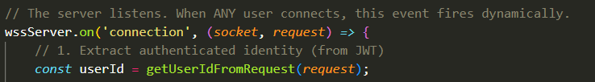
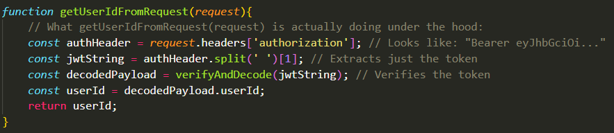

## What is a Socket?
- As you already know, a Server has One Physical Network Interface Card (NIC), which is the hardware chip where WIFI connects. That single piece of hardware receives every single piece of data (Packet) meant for the server. 

- You also already know that a for a successful network connection over the internet requires each packet traveling over the internet to contain these four peices of information, take it as a 4-tuple:
  - 1: Source IP Address (IP Address of User Machine Initiated Gathering Process)
  - 2: Source Port (The Port of the Electron Application Running on the User Machine)
  - 3: Destination IP Address (IP Address of the AEGIS Server)
  - 4: Destination Port (Since the Server is receiving HTTP requests, this would be port 443).

- Obviously, as you know, the IP address is required to identify to which machine over the internet is this data meant? and the Port is required to identify to which specific application within that machine is this data meant? an IP alone is not enough because multiple applications in the machine could be anticipating data at the same time, you need to know to which application each data belongs.
- These pieces of data are present in the headers of each packet transmitted over the internet.

- If 10,000 users connect to the AEGIS server, all 10,000 of them are connecting to Destination Port 443 in our server, and all of them are obviously connecting to the same IP address of our server, which means that the 4-tuple for all of them looks like this:
  - 1: AEGIS Server IP (Destination IP)
  - 2: 443 (Destination Port)
  - 3: Source IP (The User Machine's IP Address)
  - 4: Source Port (A random temporary port chosen by the User's OS for the Electron App, say 51234).

- So, if the OS only looked at the destination port, it would be impossible to tell all the packets apart as they're all going into the same 443 port. So, how does the OS separate the data? Here's the thing, we have these things called "Sockets". Here's how the Hierarchy goes:

  - The Port: A port is a 16-bit number (from 1 to 65,535) attached to a Packet's header. It acts as an apartment number. The server's IP Address gets the data to the building (The NIC), and the port tells the OS which specific application (apartment) is supposed to receieve it.
  - The Socket: A Socket is a Data Structure (not like a full collection, but a single object) inside the Operating System Kernel memory that represents a specific, active, end-to-end conversation between two machines.
    - When two machines communicate over the internet, they do so over a Socket. Both machines allocate a memory block in their OS Kernel called a Socket, and whenever the machine on the other end sends you data, it sends it through that specific Socket. A Socket is only between the two machines, nobody else. So, even though multiple machines could send to the same port, each one sends to its own allocated Socket
  - The File Descriptor (fd): The OS Kernel stores all of these active Sockets in a giant array. The File Descriptor is an integer, it's the index number pointing to where that socket lives in the kernel's RAM. So, you use the File Descriptor as an index to tell you where in the Array a specific Socket is. 
    - When a packet hits the physical NIC, the kernel reads the header. It sees `User IP + Port 51234 -> Server IP + Port 443`. The kernel searches its internal hash table for that exact 4-tuple. When it finds the match, it identifies the File Descriptor (e.g., fd = 104), puts the data into the socket's kernel bugger, and signals to `libuv` that data has arrived at this specific socket.
    - So, each 4-tuple represents a Socket. That Socket is acquired by taking the 4-tuple, searching the internal hash table for its corresponding file descriptor, and taking that integer as an index for the array of Sockets to find the particular socket represented by that 4-tuple. 
    - Since that Socket is meant only for the communication between the AEGIS Server and a Particular User Machine, there is no ambiguity in who the packets belong to. 

## The JavaScript Socket Object: 
- There exists this code snippet from the code we've previously shown:

- What is wssServer? It's not a custom object whose class we wrote from scratch, it's an instance of the WebSocket Server provided by a third-party library like `socket.io` or `ws`, but we're still on the basics of NodeJS now so no need to worry about the exact details of this object.
- What you do need to know however is that this server object `wssServer` inherits from the `EventEmitter` class, and sits on the specific port of `443` and listens. 
 - When a user sends an HTTP upgrade request and the OS completes the TCP handshake, once the handshake is finished, the third-party library generates a `socket` object for that user and emits the `connection` event.
 - What is this `socket` object? What does it contain? Remember how the socket is a data structure in literal kernel memory in an array? the JavaScript `socket` object returned by these third-party libraries when the handshake is completed is a C++ Binding (a reference pointer) to that Socket. So, if you call something like `socket.write(data)` in NodeJS, V8 uses that pointer to tell the OS kernel to transmit the bytes directly from the Socket.

- Additionally, there's this other parameter being received by the listener called `request`. What is this?
 - The `request` object is another object provided by NodeJS whenever a `connection` event is emitted when the Handshake is completed. 
 - The `request` object represents the raw HTTP metadata that the user sent to initiate the Websocket upgrade connection necessary to open the Tunnel.
 - When a user tries to connect to the AEGIS Server, they send an HTTP request asking to upgrade the connection to a WebSocket. This `request` object contains all the HTTP headers, the user's IP address, and even the target URL of the website.
 - The JSON Web Token (JWT) used to validate this connection is a string hidden inside one of those headers in the `request` object. Typically, the client application (That we'll be building through Electron), places the JWT inside the `Authorization` header. So, although this was omitted from the initially shown code, this is how you'd probably extract the JWT in reality:

- So, when a connection is made with the AEGIS server and the Handshake is completed, a `connection` event is emitted , the line `wssServer.on('connection', (socket, request) => {})`