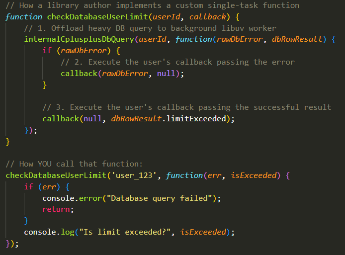

## The Two Engines of NodeJS:
- NodeJS is not a language nor a Library, it's technically a C++ runtime environment. Javascript was initially made to work with Browsers for Button Events and whatnot with no way to do anything beyond a browser.
- NodeJS actually enables JS to work out of the browser and interact with the host operating system. To achieve this, it splits the workload between two distinct engines:

 - V8 Engine: This is a JS Compiler made by Google. Its sole purpose is to take JS code, compile it down to machine code (1s and 0s) with Just-in-Time compilation, and execute it on the CPU's main thread itself. It handles math, variables, and logic. It runs things in the foreground of the CPU's main thread itself, which means that when the V8 engine itself is executing something, that thing is running synchronously on the main CPU thread and actually clogging the CPU up. The thing about the V8 engine is that it's just like standard JS; It's entirely blind to the outside world as it cannot open a file or interact with a TCP port.

 - `libuv`: This is a C++ library that gives NodeJS its connection to the operating system. It provides an asynchronous I/O model and a background C++ thread pool. When V8 needs to read a file or open a Webscoket, it offloads that job to `libuv` which communicates directly with the kernel.

- For example, when you setup an `EventEmitter` object, remember how while the listener is actively waiting for the event to occur, that listening is happening in the background on a background thread (offloaded to `libuv`. So, multiple listeners can be listening at the same time, and none of this takes up any CPU power), but when the event finally occurs and invokes the Callback function of the listener, the Callback function is executed Synchronously on the main CPU thread itself (by V8 itself), clogging up CPU execution and only executing one callback at a time from start to end line by line. This means that if you want to run multiple callbacks at the same time you actually need a Multi-Core processor. The number of cores that you have is the number of callbacks you can execute simultaneously at a time.
- Because V8 runs your JavaScript on a Single main thread, blocking that thread with heavy synchronous tasks paralyzes the entire CPU. NodeJS bypasses this with stricy Asynchronous execution; When a heavy I/O task arrives, it is handed off to `libuv` and the OS. Meanwhile, the main thread immediately moves on to the next line of code.
- Remember, I/O tasks are the ones that can be offloaded to the OS via `libuv`, not every task can be offloaded. For example, you can't execute a heavy hashing or encrypting algorithm in the background. Arithmetics are done on the CPU.

## Callbacks:
- We've already talked about Callback Functions. A callback is a JavaScript function that you write, but don't call it for execution yourself. You pass it as an argument into another function and say "Hold onto this function in memory, and execute it only when the background task finishes".
 - In the context of `EventEmitter`s, this was the `function(..)` in `eventEmitter.on("event", function(..))`. The task running in the background thread was the active listening for the `event`, and the callback being executed after the task is "Completed" (the event is heard), then this `function(..)` is the callback function that's called. 

 - There are actually two types of Callback functions. During our `EventEmitter` discussions, we only explored one type which involves Continuous Streams where the "Task" running in the background is not "Completed" once but gets invoked continuously every so often.

 ### Continuous Streams (EventEmitters):
 - When dealing with continuous streams of data (like a WebSocket funneling thousands of TCP packets), you use the `EventEmitter` class. The `.on("event", callback)` method separates successes and failures into completely different calls:
  - `Tunnel.on("data", function(packet) {...} );` Only executes when data arrives. 
  - `Tunnel.on("error", function(err) {...} );` Only executes when the Tunnel crashes.

 ### Single-Task Callbacks:
 - These are background operations that happen exactly once. They either succeed once or fail once. To handle this, NodeJS adopts a programming convention called "Error-First Callback Pattern". In this pattern:
  - A single-task callback always expects exactly two parameteres: `(error, successData)`
  - If the OS-Level task fails, the C++ engine populates the `error` parameter with a stack trace of the error and leaves the success parameter `undefined`.
  - If it succeeds, the C++ engine passes `null` to the `error` parameter and drops the data of the succeeded background operation (like a file Buffer) into the `successData` parameter.
  - The Callback function then, depending on which of these parameters actually gets populated, behaves differently, which is why typically before having the Callback function do any of its real, intended excecution, we first check right away in the function `if(error)` to cleanly terminate the process right away.

 - So, if these Callback functions are not invoked through EventListeners, how are they called? You simply pass them as an argument to a function (could be a custom-defined function or one that's already provided by NodeJS libraries and expects a function to be passed as an argument), and that function simply calls the Callback function somewhere in its body (Conventionally, the callback function is passed as the last argument of the function). 

 - The "Outer-Function" that takes in the Callback function. The execution of the Callback function depends on, and only occurs, after some background (asynchronous) task is done. This background, asynchronous task is called and initiated by the "Outer-Function" itself. For that reason, since the "Outer-Function" initiates a background task, the "Outer-Function" itself is typically an "Asynchronous Function". That's what they're called. Because they initiated Asynchronous background tasks. 
  - Then, depending on whether that task fails or not, they either call `callback(null, taskResultData)` or `callback(errorStackMessage, null)`
  - Here's an example showing this:
  
  - the `checkDataBaseUserLimit(userId, callback)` function is the Asynchronous "Outer-Function" that, as you can see, takes in the `callback` function as its last argument. 
  - The `function(err, isExceeded){}` within the `checkDatabaseUserLimit()` function is the callback function. As you can see, it has both the `err` parameter if an error occurs and a boolean `isExceeded` parameter if the background task called by `checkDatabaseUserLimit` succeeds.
  - The Asynchronous `checkDatabaseUserLimit()` function calls another function called `internalCplusplusDbQuery()`. This function has its own internal workings that we don't know of (as we won't introduce them yet), but it is the one invoking the background "Task" to happen, and to show a little bit from its inner-workings, we also give it its own inner-function.
  - If there is an error in the Task, `rawDBError` holds the ErrorMessage and `callback(rawDBError, null)` is called. Otherwise, `callback(null, dbRowResult.limitExceeded)` is called. 
  - When the Callback is called, it checks if its `err` parameter is `null` or not. If `null`, it means the background task completed successfully and the callback function then acts on that. Otherwise, if means an error occured. 

## The Event Loop:
- We've established that these Background, Asynchronous Tasks can all run simultaneously on the OS-Level in the Background on different threads with no CPU usage whatsoever. You can have a very high amount of Background I/O tasks running simultaneously in the background by `libuv`.
- For each one of these completed background tasks, there is a corresponding callback that must be executed after that. So, there will be a lot of callbacks to execute coming from all of these background tasks running simultaneously.
- However, the problem, as discussed, is that these corresponding callbacks resulting from the completed tasks can only be executed Synchronously by the V8 Engine itself on the Main CPU thread one-by-one. 
- So, you'll probably be having a very high amount of callbacks coming up to be executed by the V8 engine, but it can only execute one callback at a time (with a single core), which means you'll probably have more callbacks coming in than you can execute them at any given moment. 
- So, how are these corresponding callbacks managed and how are they actually pushed onto the main V8 thread for execution? It all revolves around the "Event Loop"

### How The Event Loop Works:
- This is the core mechanism that allows NodeJS to perform non-blocking, asynchronous I/O operations even though JS itiself is single-threaded. 
- The Event loop is literally a continuously-running C-level `while(true){}` loop. One full rotation of this loop is called a "Tick" (Conceptually identical to a video game engine tick for physics).
- The Event Loop consists of 5 distinct phases (technically 6, but one of them is entirely NodeJS for housekeeping so we'll ignore it), and everything revolves around these phases and what happens in them:

#### Phase 1: Timers Phase (`setTimeout`, `setInterval`):
- In your code, there are two functions that you can call `setTimeout(callback, ms)` and `setInterval(callback, ms)`. These two functions are used on callbacks when you want them to be executed in the future after a certain period of time in milliseconds (The function passed to these timer functions are technically callbacks because by definition a callback is a function that's passed as an argument to another function. This is irrespective of any background tasks or anything like that).

- When you create a timer, NodeJS stores it in a min-heap datastructure managed by `libuv`. Here's what happens:
 - The min-heap organizes timers so that the one expiring the soonest is always at the top.
 - When the Event Loop starts a new tick (iteration) and enters the Timers Phase, it checks the Timer at the top of the heap.
 - If the current time is greater than or equal to that timer's expiry threshold (The timer is over), the callback function in its arguments is pushed to the call stack for execution.
 - The loop continues checking other timers and executing the expired timers sequentially until the current soonest-expiring timer becomes one that is not yet ready. 

- One thing to note about Timers is that they are "At Least Thresholds". The delay argument `ms` you pass to a timer is a "minimum threshold", not a guaranteed execution time. NodeJS only guarantees that this callback will not run BEFORE that during of `ms` has passed, but not exactly as soon as it passes. Delays can happen if the Event-Loop gets hanged up by a long-running synchronous task like a very heavy callback. For example, if you schedule a timer for 100ms, but a "file read" operation takes 150ms right before it, the callback will actually wait at least 150ms to be executed because of the holdup by the reading operation. 

- Another thing to note is that even if you pass `0` (or a negative value) as the delay: `setTimeout(callback, 0)`, NodeJS enforces a minimum delay value of "1" millisecond. 

- For AEGIS, the Timer Phase is very important. For example, in AEGIS, to prevent any malicious DOM Bombs that have infinite JavaScript Loops, we set an execution timeout on any Docker Container. If the Timeout threshold is 30 seconds, then we would write `setTimeout(destroyDockerContainer(container), 30000)` NodeJS puts the `destroyDockerContainer(container)` call in the Timer Min-Heap. On every tick (iteration) of the Event Loop checks the Timers Phase. Once 30,000 milliseconds have passed, it executes the callback and kills the container.

- The difference between `setTimeout()` and `setInterval()` is that `setTimeout()` only calls its Callback function ONCE after the `delay` is over. Meanwhile, `setInterval()` indefinitely calls its callback function after each `delay` pass. So, in `setInterval(func, 3000)`, `func` would be called every 3 seconds. 

- To stop `setInterval()` from calling its callback function more, you'd find the ID of the intervalTimer (`intervalId`) and do `clearTimeout(intervalId)`. Similarly, for `setTimeout()`, to stop a timer and cut it from executing its callback once the timer is over, you do `clearTimeout(timerId)`. 
 - What is this `timerId` and `intervalId`? Well, you don't actually need a numeric ID. You see, the `setTimeout()` and `setInterval()` functions also return a special `Timeout` object. For example: `containerTimeout = setTimeout(destroyDockerContainer(container), 30000)`. You can then pass that returned `Timeout` object (`containerTimeout`) as an argument to `clearTimeout(containerTimeout)` and it will kill the timer. 
 - Note: The `Timeout` object returned by `setInterval()` is never removed and therefore never collected by the Garbage Collector automatically unless you call `clearTimeout(IntervalObject)` yourself. 

- It may be obvious as to why, but `setInterval()` with its repeated calls can be problematic. The thing about `setInterval()` is that it doesn't start its next timer for the next call of the `callback` once the previous `callback` call has finished executing. It schedules the next execution based on the start time of the previous execution (When the call for the `callback` was made); It does not wait for the code inside the callback to finish before starting the countdown for the next run.
 - If your interval is set to 100ms, but the code inside the callback takes 150ms to run, `setInterval` will push the next callback to the Timers Phase min-heap in 100ms before the previous callback has even finished executing. This, over calls, builds up more and more, causing callbacks to stack up in the Event Loop queue, choking the entire application. 

#### Phase 2: Pending Callbacks Phase:
- This is a very misunderstood phase. From its name, you'd think it's the phase where callbacks called in this tick (iteration) of the loop are executed, but that's actually the job of the next (Poll) phase, not this one. 
- This phase executes I/O callbacks that were moved to the next loop iteration. 
 - When the operating system or `libuv` attempts an operation and it fails or triggers some specific system behavior, `libuv` will occasionally decide decide NOT to run that failure callbackin the current iteration (Pool Phase). Instead, it moves the callback into a "pending queue" to execute at the very start of the next loop cycle (right after the timers phase).

- Because this phase handles background, low-level operations, you rarely encounter them explicitly in JavaScript, but it could happen a lot in AEGIS as example include:
 - TCP System Errors: If a TCP Socket attempts to connect to a server and receives an immediate `ECONNREFUSED` error from the operating system, `libuv` catches this error and queues the callback to this phase to report the error cleanly on the next tick. 
 - Stream Write Completions: If you are writing a massive buffer of data to a stream (like a network socket) and the OS buffer fills up, `libuv` waits until the buffer kernel clears of the already-sent data. Once it's clear and the remaining data writes successfully, the completion callback may execute in the pending phase instead of holding the loop up while the kernel clears.

- Obviously, from what you can see, you don't get to decide what gets sent to the Pending Callbacks Phase. Even though you don't write code directly for the Pending Callbacks Phase, it can impact execution timing if a low-level error occurs. 

- Why does `libuv` delay these Callbacks? The next phase is called the "Poll Phase" where most of the regular callback execution is done. If an I/O operation crashes in the middle of a massive Poll Phase with many callbacks, running the error logic instantly could block other active network events from processing and cause some starvation.
 - Additionally, in the case like the "Stream Write Completions" one described above, delaying these callbacks sometimes gives NodeJS and the OS a "breather" to free up registers and kernel memory before executing more code or writing more data.

#### Phase 3: Poll Phase:
- This is the heart of the NodeJS Event Loop and it is where the application spends 90% to 95% Of its time when running an active server like AEGIS because this is where most Callbacks are executed.
- Unlike other Phases that have a predetermined list of callbacks to execute, the Poll Phase handles incoming I/O events, reads data, and determines how long the Event Loop should "sleep" for new work (more on this later).

- The Poll Phase has a standard Queue called a Poll Queue. Remember how multiple tasks can run in the background synchronously, resulting in many callbacks being invoked, but only one callback can be executed at a time per CPU core so the number of Callbacks eventually builds up? This is where they are placed. When a Task is finished, its corresponding callback is moved to the end of the Poll Queue, and that order is maintained. So, tasks that finish first have their callbacks executed first.

- The Poll Phase executes any callback that is currently sitting in the Queue when the Poll Phase is active regardless of when it arrived (The callback could have arrived during the previous iteration of the loop).
 - If a callback was generated during a previous tick but wasn't processed (maybe it was generated AFTER the Poll Phase had finished up or due to a queue timeout limit), OR if a background thread finishes an operation while the event loop was moving through the "Timers" or "Pending" phases of the current tick (Point is, it doesn't matter if it was in this tick or the previous one), that callback sits in the queue waiting for the loop to arrive to the Poll Phase and reach it.

- Does the Poll Phase execute EVERYTHING in the poll queue before moving forward to the next phase? Not always. While the goal is to drain the queue, `libuv` implements a safety mechanism to prevent "Event Loop Starvation" where the Loop is stuck in the Poll Phase.
 - If the AEGIS server is experiencing an absolute flood of incoming I/O events (e.g., millions of of network packets flooding the sockets), the Poll Phase queue could theoretically fill faster than NodeJS can execute them. If NodeJS stayed there until it was "empty", it would freeze inside the Poll Phase forever.
 - `libuv` imposes a hard limit on how many callbacks it will execute consecutively in a single Phase (Whether it may be a Poll, Timer, Pending, or whatever Phase) before forcing the loop to move forward to the next phase.

- When a background thread (from the `libuv` thread pool) finishes a task and it has a corresponding callback, there are two cases:
 - If the loop hasn't yet reached the Poll Phase or is currently inside it, the callback is immediately injected into the Poll Queue and if the loop hasn't hit its limit and there aren't too many callbacks in the Queue, it can execute the Callback in the exact same iteration.
 - If the loop has already passed the Poll Phase (e.g., is currently executing a callback in the next phase called the "Check" Phase or is wrapping up close Callbacks in the "Close" Phase), the callback is still added to the Poll Queue, but the loop must finish its current iteration, pass through the Timers and Pending phases again, and only then handle it in the Poll Phase of the next iteration.

- There is actually another thing that the Poll Phase does. If the Event Loop arrives in the Poll Phase, and actually finds that the Poll Queue is entirely empty, with no callbacks in it whatsoever, not even one, then the Poll Phase actually attempts to freeze the Loop at the Poll Phase, not allowing it to go into the next phases, until new callbacks arrive into the queue for it to execute, but this comes with some restrictions and cases:
 - Case A: At least one `setImmediate()` exists: We haven't discussed this yet, but the next phase is called the "Check" Phase, and in this phase, `callback`s passed into the `setImmediate(callback)` function are executed. If you schedule a `setImmediate` callback, the loop will NOT wait in the Poll Phase. It immediately breaks out of this Phase and advances to the "Check Phase" to execute those callbacks (More on this later in the "Check Phase" discussion).
 - Case B: A Timer has expired: If a timer has expired and therefore its callback is ready to run, the loop breaks out of the Poll Phase (It doesn't always break out of it when a Timer ends, only when the Queue is empty. If there are still I/O callbacks sitting in the Queue, NodeJS will continue executing them. This is why `setTimer(func, delay)` can sometimes be delayed beyond the specified `delay`. It is only a minimum threshold, not an absolute one). After breaking out of the Poll Phase, it normally goes through the two next phases before starting the next Iteration to execute these expired timer's callbacks.
 - Case C: If none of the two cases above happens, meaning NO `setImmediate()` callbacks nor expired timers, the Event Loop will freeze inside the Poll Phase and wait for a new I/O event to arrive. As soon as a new callback arrives, it is placed into the Queue and executed immediately. How long does the Event Loop freeze inside the Poll Phase? If a Timer expires before any new callback comes into the queue, the loop breaks out of the Poll Phase. 

- This Poll Phase blocking is nice because if no one is utilizing the AEGIS server, then instead of the CPU pointlessly looping through the phases indefinitely while nothing is happening, `libuv` puts the main thread to sleep inside the Poll Phase. The operating system wakes the thread up only when a network packet arrives. 

#### Phase 4: Check Phase:
- As we briefly hinted before, the sole purpose of this phase is to execute callbacks registered via `setImmediate(callback)`. 
- If the Event Loop finishes executing its callbacks in the Poll Phase and finds that the queue is empty, it checks if any `setImmediate()` callbacks have been scheduled. If even one exists, the loop will NOT wait any extra second; It immediately advances straight to the Check Phase to run it.
- `setImmediate()` is designed to queue a callback to run immediately after the current poll phase completes. Think of it as saying "Finish Processing the current batch of incoming network data and then run this code right away before doing anything else".

#### Phase 5: Close Callbacks Phase:
- This phase is dedicated exclusively to executing callbacks associated with termination or closing of system resources. 
- If a socket or stream is closed intentionally or unexpectedly, the operating system and `libuv` clean up the underlying file descriptor (In the case of a Socket, this would mean going into the array of sockets, going into the index specified by the file descriptor, and making that kernel memory location available).
- For example, when a TCP connection is dropped or closed via `.destroy()`, its `close` event listener fires and the callback function in it is executed in this phase: `Tunnel.on("close", func)`

- Why have a dedicated "Close" Phase anyway?
 - Closing a resource usually means releasing memory. NodeJS treats resource disposal as its own phase to ensure that cleanup code doesn't get buried or delayed behind a massive queue of incoming data or network requests in the Poll Phase.
 - Separating data operations (Poll) from destruction operations (Close) prevents conditions where an application may attempt to write data to a socket that is already mid-closing. 

#### What happens After The Close Phase:
- When the Close Callbacks phase Completes its queue of Callbacks, the Event Loop briefly pauses to check its status:
 - Are there any active references left? If there are any active timers (or references of timers like an un-cleared interval), open database connections, or active I/O listeners, the loop ticks forward to the next iteration and jumps back to the Timers Phase for the next tick.
 - Is the loop entirely empty? If there are zero active timers, connections, or references to timers, NodeJS concludes that the program has finished its work. The Event Loop stops spinning, and the main NodeJS process exits back to the terminal. The program terminates.

- In the case of AEGIS, even if there are no live established connections with any users and no user is currently connected and trying to establish an EvidenceGathering process, the program still stays up and it does not terminate. Why? Because AEGIS will always have the `wssServer.on('connection', (socket, request) => {}` listener on-going, listening-in on the background for new users to connect, and as we establishes, if there is even a single active I/O listener, the loop keeps iterating through more and more ticks. 