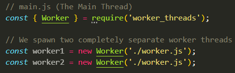
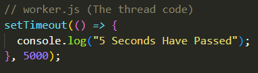
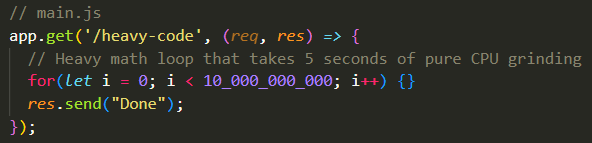
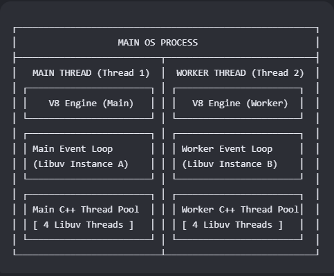
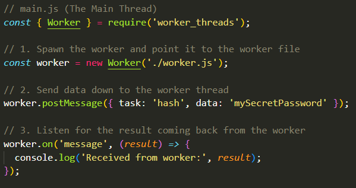
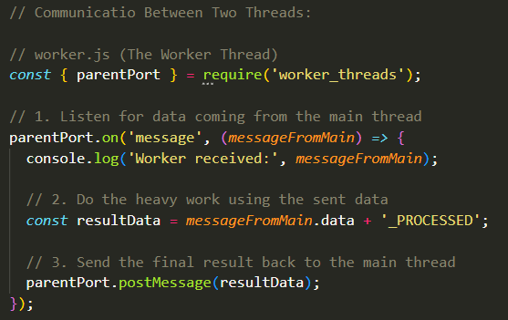

## NodeJS vs Python Threads:
- In NodeJS, your code runs on one main thread. There is no rapid "hot potato" passing of a "Global Interpreter Lock" like python. If you write a heavy loop on the main thread, everything freezes. 
- To do Multi-threading in NodeJS, you use the `worker_threads` module. When you spawn a Worker, NodeJS spins up a completely separate JavaScript engine instance (V8 Engine) on a brand new thread.

## Multi-Threading in NodeJS:
- Let's say you have a single CPU core, but you want to run multiple tasks at the same time. With a single core, you can create multiple threads, but you can't get true hardware parallelism. 
- A single CPU core can only ever execute one instruction at a single instantaneous point in time. It cannot run two threads at the exact same physical split-second.

- Consider this NodeJS setup using manual Worker Threads:
 - In `main.js`, in the main running thread we spawn two separate worker threads. We make both threads work on the exact same file which is the `worker.js` file. So, the main thread spawns two separate threads and tells each one of them to run that `worker.js` file. Each one of them starts running that file on its own.
 - Keep in mind that the `setTimeout(func, delay)` function executes the callback `func` after `delay` milliseconds.

  
  

 - The odd thing that we find when we run this code is that both workers print their messages at the exact same time after 5 seconds total instead of taking 10 seconds. 
 - This means that when `worker1` was spawned and it started working on its own instance of `worker.js`, the main thread didn't stop and wait for 5 seconds; It also spawned `worker2` and both workers were running their own instances of `worker.js` simultaneously. How does this even happen?
  - It works this way because of how the operating system handles waiting. When `setTimeout()` is called, the JavaScript thread isn't doing any actual CPU work. It registers the timer with the Operating System kernel and goes completely idle. The CPU doesn't just freeze itself calculating every millisecond going by, doing nothing else, to countdown this timer. It just offloads it to the OS and continues doing something else.
  - Because "waiting" consumes 0% CPU, a single core can easily manage both workers. The OS kernel tracks both 5-second countdowns in the background simultaneously while the CPU sits idle.

- Furthermore, if you ran the `setTimeout()` calls back-to-back on a single main thread with zero worker threads, it would still only take 5 seconds total.
 - Why? Because waiting is free. The main thread hits the first `setTimeout()`, hands the 5-second countdown to the Operating System Kernel, and immediately moves to the next line.
 - It hits the second `setTimeout()`, hands that 5-second countdown to the OS kernel, and finishes.
 - The Main Thread is now completely free. The OS Kernel counts both timers down at the same time in the background.
- Therefore, you NEVER use `worker` threads for timers, file reading, or network requests. The main thread can already do millions of these concurrently on a single core without freezing.

- Workers in NodeJS are Isolated: Another thing to note about NodeJS workers is that they do not share memory by default. They are completely isolated worlds. They communicate by sending messages (`postMessage`).

- The Main Thread is King: The primary goal of using worker threads in NodeJS is to protect your main Event Loop thread from freezing so your server can keep accepting web traffic. 
## CPU-Bound Tasks:
- So, what do Worker threads even do if you're on a Single CPU Core? Worker Threads are strictly meant for CPU-Bound Tasks (heavy math, encryption, hashing, etc.). To make things clear, we can see how a heavy CPU loop behaves on a single core with and withhout worker threads and compare the two cases:

### Heavy CPU on the Main Thread (No Workers):
- Consider the following code snippet:
  

- On a Single Core, the Main Thread is trapped inside that loop for maybe 5 seconds. Because the Event Loop is completely frozen on this core, if another user tries to connect to AEGIS during those 5 seconds, the server literally cannot event accept their request. The server becomes dead to the outside world.

- Now, say you move that heavy loop into a manual `worker` thread.
 - On a Single Core: You will still have one physical core. The core cannot run both threads at the exact same split-second. 
 - Time Slicing: The OS kernel makes that single core rapidly jump back and forth; It runs the Worker Thread's heavy loop for 10 microseconds, then pauses it. It flips to the Main Thread's Event Loop for 10 microseconds, doing any work required by the Event Loop (such as checking if any new users are trying to connect), pauses, and flips back to the heavy loop.
 - Because of the overhead introduced by the rapid switching, the heavy loop might now take 6 seconds to finish instead of 5. However, the Server actually stayed alive. It was able to accept incoming traffic and do other work because the Main Thread's Event Loop was given regular micro-breaks by the OS to do its job.

- So, yes if there are CPU-Bound operations, especially if they are heavy, even if you're on a singular core, having `worker` threads is very important.

 ## Multi-Core Case (True Parallelism):
- When you take that second scenario of `worker` threads and you mix that with a Multi-Core processor, the operating system stops playing the "time-slicing" illusion game and you achieve true parallelism.
 - Core 1 is assigned exclusively to the Main Thread's Event Loop. It stays at 0% CPU usage, running the Event Loop completely care-free. It can accept incoming connections, traffic, and do other tasks.
 - Core 2 is assigned to the Worker Thread. That core actually gets its CPU used as it grinds through the heavy loop at maximum speed.

- In this Multi-Core Setup, the heavy task finishes in its optimal 5 seconds, and the main server loop is completely unbothered, running at 100%. We're not getting this concurrency illusion of running two things simultaneously, but we are in reality actually doing it. 

- Threads are actually automatically distributed by the operating system equally across your cores.
 - You don't get to specify "Put Worker 1 on Core 3." Instead, the Operating System Kernel monitors all cores. If it sees Core 1 is handling your Event Loop and is at 10% capacity, and you spawn a Worker that demands 100% CPU math, the OS will automatically throw that heavy worked on Core 2, Core 3, or whichever core is currently the least busy. 

## `libuv` Threads:
- NodeJS's `libuv` library, created in C++, was developed such that whenever a NodeJS program boots up, `libuv` automatically spawns a "Thread Pool" consisting of 4 threads by default (You can alter this number of threads from 1 up to 1024 using the environemnt variable `process.env.UV_THREADPOOL_SIZE = 8;`).

- So, what do these threads even do? It's actually pretty simple. Whenever you call a built-in NodeJS operation, one which is not truly asynchronous (something like a file I/O operation, Compression, Crypto Operations), NodeJS does not want to freeze your main JavaScript Thread and Event Loop to execute this non-background task. So, libuv takes that file request, hands it to one of its internal C++ background threads, and makes it do that task.
- The thing with `libuv threads` is that they cannot run any JavaScript code at all. They cannot run a for-loop or any JS code that you've written yourself as these are CPU-Bound operations. `libuv` threads can only perform non-CPU-Bound operations that are not truly asynchronous (Since truly asynchronous tasks don't even need threads).

- These threads behave just as you would expect:
 - If your machine has one core and you call something like `fs.readFile()` alongisde a heavy native hashing operation (a hashing function defined by NodeJS and recognized by `libuv`), `libuv`'s internal threads will compete for that single core. The OS kernel will use the "time-slicing" hot potato chicanery strategy to rapidly bounce back and forth between the Main Event Loop thread and these two `libuv` threads. This ensures that even while a file is being read or a password is being hashed, the main thread still gets regular micro-breaks to keep the server alive.
 - If your machine has multiple cores, the OS will distribute these `libuv` threads across your cores. For example, it will pin your Main Event Loop thread to Core 1, and it will distribute `libuv`'s 4 internal threads across Core 2, Core 3, and Core 4.
 - If you are running built-in NodeJS tasks like file reading or native crypto, you get true hardware parallelism out of the box without writing a single line of multi-threaded JavaScript code. However, you'll need to define your own actual `worker` threads manually if you want full, unconditional parallelism where even your custom JS code is executed in parallel.

- Basically, `libuv` threads are essentially just built-in `worker` threads that can run low-level NodeJS-Defined tasks instead of raw JavaScript code.

### Why Even `libuv` Threads?
- So, if it looks like `libuv` threads are just like `worker` threads except they appear to be worse because they can't run full JS code and only low-level NodeJS tasks, then what really is the point of `libuv` threads?

- One very important thing to understand about `worker` threads is that when you spawn a new worker thread using `new Worker()`, NodeJS spins up an entirely self-contained replica of the complete NodeJS environment. Inside every single Worker Thread, you get a complete sandbox containing:
 - A new V8 Instance with its own private JavaScript execution contexxt and heap memory.
 - A brand new `libuv` Event Loop instance that is completely separate from the main thread's loop.
 - A brand new `libuv` C++ Thread Pool with its 4 default background threads.

- The only reason `worker` threads can do low-level stuff is because every single worker thread spawns its own interval `libuv` instance on top of itself and utilizes these `libuv` threads to actually communicate with the OS, NIC, and do low-level tasks.
 - Recall that a V8 Engine can only do arithmetic, variables, and compilation to machine done; It cannot communicate with the internet, operating system, or even do anything in parallel. It's `libuv`, the library developed by NodeJS that gives NodeJS all of these abilities, and without these `libuv` threads, these newly spun up V8 Engine Copies made for the new `worker` threads will not be able to communicate with the OS.

- Here's a visualization to see the Architecture Layers as a Cake:
  

- So, this is why true parallelism can actually work. You are literally creating a full new NodeJS runtime environment, handing it off to a different CPU core, and telling that CPU to only worry about that runtime environment and forget the main one. It even has its own Event Loop and has no idea what's going on in the main one. 
 - Obviously when two `worker` threads, meaning two runtime environments, do share the same CPU core (maybe you created more threads than there are cores), then the CPU core does the rapid back and forth "hot potato" chicanery strategy between the two threads within that core. 

- Now, you might be wondering, "If `worker` threads can do low-level tasks using their own `libuv` threads, why do we need a `libuv` thread pool on the Main Thread? Why not just make a worker whenever we want to read a file?"
 - The answer comes down to Resource Overhead. Spawning a `worker` thread is actually an incredibly "expensive" operation for computer memory. 
 - Spawning a Worker Thread requires initializing a massive V8 Engine and allocating a completely separate chunk of RAM (usually at least 20MB to 30MB of memory overhead), and if you're only going to do low-level tasks on that Worker Thread, then you've allocated all of that RAM just for it to sit idle because the low-level tasks are going to be done by the `libuv` threads in that `worker` thread anyway and won't even need the RAM. The RAM is needed for heavy, custom JS code, which is what a `worker` thread expects. 
 - Using the Main Thread's Libuv Pool requires 0MB of extra JS overhead as the threads are already sitting there and pre-allocated from the millisecond NodeJS booted up. Passing a file-read task to them is practically instantaneous and costs next to nothing in system resources.
 - What's going to happen is that when that internal work (such as a file-read) gets offloaded to a `libuv` thread that belongs to the Main thread's runtime, the operating system will automatically push that `libuv` thread onto your other cores. So, the work is done in other cores without having to copy over an entire runtime environment and waste resources, and your Main Thread remains un-interrupted.

- Basically, `worker` threads do not bypass `libuv`; They replicate it. Every `worker` thread is a completely autonomous clone of NodeJS running its own V8 Engine and its own `libuv` Event Loop with its own C++ Thread Pool. While this means a Worker can perform low-level file and crypto tasks independently, we still rely on the Main Thread's built-in `libuv` pool for standard I/O tasks because spinning up an entire duplicate V8 engien instance just to read a file would be a massive waste of Server Memory.

## Can Cores Be Wasted Without Worker Threads? 
- If you have a Multi-Core processor but you don't spawn your own `worker` threads, are these cores just entirely wasted and un-utilized? It depends.

- For your own custom JavaScript code: Yes. During the execution of custom JavaScript code, if you don't manually spawn `worker` threads, that code will run on a single core. The other cores will sit completely idle regarding your JavaScript.

- For NodeJS internal tasks: No. NodeJS will spawn the `libuv` threads. The operating system will then automatically push those threads onto other cores. So, your cores are used, but only for these internal tasks and I/O operations. 

## How Different Threads Communicate:
- Because `worker` threads are completed isolated worlds, they do not share variables or memory with the main thread by default. If you change a variable's value inside a worker, the main thread will actually never know and will retain the old value. 
- To exchange data, threads pass messages back and forth asynchronously using the `postMessage()` API and event listeners.

- Let's say you're at `main.js` and you spawn a `worker` thread called `worker` that will work on the `worker.js` file and execute it. If you, in `main.js` call:
 - `worker.postMessaage({ data : "hello" });`
- Since it is the main thread that is executing this code (even though `worker` refers to the worker thread, not the main one), it is the main thread that's sending this message TO the `worker`. The thread executing the file, executing that line of code, is the one sending the message. Meanwhile, the thread whose object (`worker`) we're using to call the `worker.postMessage()` function is the one on the receiving end.
- So, the general notation is something a bit like this: `receiver.postMessage(data)`. Meanwhile, the sender is the thread executing that script. 

- Here's the thing, whenever a thread is executing the file assigned to it, it doesn't automatically just know who spawned it. However, there is a direct pipeline to the direct parent thread that spawned it provided by NodeJS and that is the `parentPort`. 
- If you're in a file (`worker.js`) that you intend to be executed by the child thread of some other thread, then writing `const { parentPort } = require("worker_threads);` gives you direct access to a reference of the parent thread that spawned the thread that will execute this file. A direct reference to the thread whose script states `const worker = new Worker("./worker.js")` in it.

- A thread could technically receive messages from multiple different other threads, even non-parent threads (More on that later, we'll focus on the parent thread only now). So, the thread may want to do something different depending on who it receives the message from as it could intend to do something different with the different data it anticipates from other threads. 
- So, threads actually receive messages through Event Listeners. A message could come at any time, and they could come in streams. So, a thread needs to always be listening-in to messages and so we treat these message exchanges just like Streams.
- Whenever a thread sends a message, it emits a `messsage` event which can be listened to. So, if you want to listen to that event on another script being executed by another thread to acquire the data of the message, you'll need a reference to the sender thread. 
- That brings us to `parentPort`. If the sender thread is your parent (The one that Spawned you), then writing `parentPort("message", (MessageData) => {})` in `worker.js` means that whenever your parent thread (`parentPort`) sends you (`worker`) a message and emits the `message` event, it will be caught and the data sent from the parent thread will be captured in the parameter of the callback function `MessageData`.
- So, whenever you write `Thread1.on("message", (MessageData) => {})`, the thread (`Thread1`) that you are referencing is actually the sender thread. So, the general notation can be seen as" `senderThread1.on("message", (MessageData) => {})`

- By The Way, the `postMessage(data)` function takes in anything. That `data` parameter could be any JavaScript primitive or object: Strings, Numbers, Booleans, Arrays, or Objects. 

- Now, let's look at what's happening in the following two files:
  

  - First, we spawn a new `worker` thread. This because a "child thread" of our main thread since the main thread is the one executing this file which happens to spawn the `worker` thread. The `worker` thread is pointed to execute the `worker.js` file.
  - Then, we write `worker.postMessage({ task: "hash", data: "mySecretPassword"});` Remember, this means that the main thread is sending this object to the `worker` thread. 
  - Then, the line `worker.on("message", (result) => {console.log("Received from worker", result); });` as discussed, means that the main thread will listen in for a `message` sent to it by the `worker` thread as it expects a response from it. It can capture that response in the `result` parameter so that it can be used.

  

  - We start off by getting the reference to the parent thread which spawned the thread running this script: `const { parentPort } = require("worker_threads");`. The `parentPort` object can be used to reference the main thread now.
  - Then, through `parentPort.on("message", messageFromMain) => {console.log("worker received:", messageFromMain);});` we say whenever the parent main thread emits a "message" event to this thread, we want to catch that event and capture the message within the `messageFromMain` parameter, and then we want to print out that we got this data.
  - Then, with the `const resultData = messageFromMain.data + "_PROCESSED";` Line it's just a placeholder to say that we then want the thread to obviously do something with this data. The whole reason data is offloaded from the main thread to another thread is for the other worker thread to do something heavy with that data (such as hashing or encrypting it, which is exactly what we'll be doing in AEGIS) without blocking off the main thread's execution, and then the child thread sends the result of the heavy operation on the data back to the main thread to work with seamlessly.
  - The final line `parentPort.postMessaage(resultData);` is the one that does the sending back. Remember that in `thread.postMessage()`, `thread` referes to the one receiving the message while the thread executing the script is the sender. So, the `parentPort` thread, which is the main thread, is the one receiving the message and the one sending it is the `worker` thread spawned by the main thread.
  - The main thread receives this data through the `worker.on("message", (result) => {});` line in the `main.js` script in the `result` parameter as whenever the `worker` thread does send the message, it emits the `message` event directly to the parent thread which is caught by this line.

- So, the big thing to remember is that it goes like this:
 - `receiver.postMessage()`
 - `sender.on()`

## Can Multiple Threads Run Parts of the Same File (Divide and Conquer Parallelism)? 
- Previously, we've seen an example where each file instance is offloaded to a single worker thread for it to execute the entire file line by line. However, not only can you do that, but you can write your code such that you also assign half of the file's work to one worker and another half to another worker (or make even more intricate splits like quarters with four workers) and as long as you have Multiple Cores, both threads can execute their assigned portions of the file at the exact same time on separate cores, effectively cutting down execution time in half (Assuming you split the file in half based on work-needed).
- For example, if you have a file containing a list of 1,000,000 numbers to calculate, you can spawn two workers:
 - Tell `worker1` to process lines 1 -> 500,000
 - Tell `worker2` to process lines 500,001 -> 1,000,000

- However, this won't be discussed right now and will be left for future discussions if needed. 

