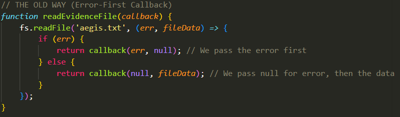
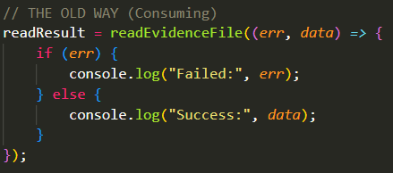
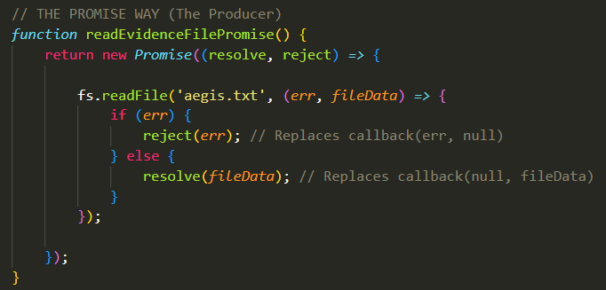

## Single-Task Callbacks:
- Remember our Earlier Discussion on "Single-Task Callbacks". 
 - We stated that there are "Continuous Stream Callbacks" where the background task associated with the callback is an actively-persistent task that happens occassionaly multiple times like a stream, each time the background task "Completes", a certain "event" is emitted, causing the callback to be activated, which means that the callback usually gets activated many times. Such callbacks are passed as parameters to a sort of `EventEmitter` function, specifically the `.on("event", callback)` function, which listens in to these specific `event`s and activates the `callback` function each time the `event` is emitted by the same `EventEmitter` object that is listening in to that `event`.

 - On the Other side, there are "Single-Task Callbacks". These are just functions with exactly two parameters that follow the "Error-First Convention": Their first parameter being the `error` parameter and the second being the `SuccessData` parameter. These functions are also tied to a background task but a background task that only executes once instead of being a constantly running one. This specific background task tied to the callback could either fail or succeed.
  - If it fails, then the first `error` parameter of the callback is populated with the Stack Trace of the error and the `successData` parameter is set as `null`. If it succeeds, then the first `error` parameter of the callback is set as `null` while the `successData` parameter is populated with the data that the background task outputs after it has successfully executed. 
  - These callbacks, just like the Continuous Stream Callbacks, are also passed as an argument (typically the last parameter) of another "Outer-function". This "Outer-function" that took in the callback was the one to initiate the background task and activate the callback upon its completion. If the background task fails, the "Outer-function" calls `callback(err, null)`. If it succeeds, the "Outer-function" calls `callback(null, successData)`. Then, the callback will either return an error or will do something with that `successData` and then return it based on the failure or success of the background task. 
  - Keep in mind that this "Outer-function" is sometimes called the "Producer" as it is the function that DOES the background work. It initiates the single-time background task (like reading a file or querying a database) and then based on the result of that, calls the `callback` function it received with according arguments.

   

   - For example, the `readEvidenceFile(callback)` function above is considered a Producer function. Notice that it takes in a SINGLE callback (it can take in other arguments too, but only one callback as its last argument), it then initiates a single-time background task which is a file-read `fs.readFile()`.
   - The funny thing is that the line of code that activates the file-read background task is also in itself a function (this time a NodeJS-defined one) that takes in the name of the file to-be-read (in this case it's `aegis.txt`), and takes in a callback function in the form of an anonymous function `(err, fileData) => {...}`. Not only that, but this callback, upon getting its data from the background operation, also follows the "Error-First Convention" of having the two parameters `(err, fileData)`. So, `fs.readFile()` is in its own way a producer function as well.
   - After that, as we've discussed, it is checked whether the single-time background task failed or succeeded. If it failed, then the `err` paramter of the `(err, fileData)` callback gets populated with the Error Stack Trace and `fileData` remains null. So, when we call the callback, we call it with `callback(err, null)`. Otherwise, if it does succeed, then the `fileData` parameter of the `(err, fileData)` callback gets populated with the data returned by the background operation (which is the data of the file in this example), and we get to call `callback(null, fileData)`.
   
 - For the sake of a concept that we need to explain when discussing `Promise`s in a bit, we'll also introduce the idea of a "Consumer", which is basically the code that WANTS the result of the Single-Task Callback that we passed into the "Producer" function. This doesn't have to be a function or anything, but a line of code that calls the "Producer" function and passes the Callback function to it:

  

## Promises:
- A Promise is yet another way to do Single-Task Callbacks. A Promise represents an event that happens exactly once and its state is then permenently frozen. It can never "Resolve" twice.
- A `Promise` instance is a C++ Object containing three core properties:

 - `PromiseState` property: A string that can only be in one of three states:
  - `pending`: The background work is still running. The variable has no value yet.
  - `fulfilled`: The background work finished successfully. The value outputted by the background work has arrived to the Promise Object.
  - `rejected`: The background work failed and the error has arrived to the Promise object.

 - `PromiseResult`: The actual data resulting from the background work (or the error object) once the state transitions out of `pending`

 - `PromiseFulfillReactions`: An internal array that holds the callback FUNCTIONS you passed into `.then()` (Yes, multiple callbacks can be invoked when the promise is fulfilled, not just one like in the Error-First convention method).

 - `PromiseRejectReactions`: An internal array that holds the callback FUNCTIONS you passed into `.catch()` (Yes, multiple callbacks can be invoked when the promise is fulfilled, not just one like in the Error-First convention method).

- A Promise is write-once. It transitions from `pendng` to either `fulfilled` or `rejected` exactly once. Once it settles, its state is completely frozen and fixed. It cann un-fulfill, un-reject, or change its `PromiseResult` value. 

- We'll go into the details of this later, but a Promise was essentially invented as a way to solve a certain dilemma, and we'll only later on discuss why this dilemma exists to begin with:
 - Imagine you have a variable that you want to pass into downstream functions (functions that are in the later lines of code) but the actual data for the variable does not exist yet. (We'll see how this can happen later).
 - You can't just pass the actual value (since it doesn't exist, you may not know what it is), nor can you pass the variable itself since it doesn't hold a value yet.
 - Therefore, you must pass an "Object that represents the future value". We call that object a "Promise". You can think of a Promise as an official legal placeholder, like a receipt. It states: "I don't have the data right now, but I PROMISE I will hold the space for it, and when the background work finishes, I will fill this object with the value, which you can use". 

- Here's the neat thing, remember this Error-First Callback function that we discussed just now? 
   

- When you create a Promise instance, you replace that single `callback` parameter with two separate channels: `resolve` and `reject`. 
 - These two things are actually functions. When you write `new Promise( (resolve, reject) => {...})`, the V8 Engine automatically creates those `resolve` and `reject` functions for you to use in your code. 

 - Calling `resolve(successData)` permenently flips the state of the Promise object to `Fulfilled`. It also acts as a replacement to `callback(null, successData)` as it gives the Promise object the `PromiseResult` value of `successData`.
 - Calling `reject(error)` permanently flips the state of the Promise object to `Rejected`. It also acts as a replacement to `callback(error, null)` as it gives the Promose object the `PromiseResult` of the `error` object with the Stack Trace.

- Here's how the "Producer" function would look in the "Promise Way". It actually looks pretty neat. Notice how the Promise Version does NOT take a callback in its arguments. Instead, it returns the Promise Object itself immediately. It hands you that "recepit". I guess you can call it a "Promise Producer" function:
   

- Because the Promise version returns a Promise object instead of taking a Callback, you have to attach the success and failure logic directly to that object. That is exactly what `.then()` and `.catch()` are.
 - They are just built-in methods on the Promise object that allow you to register callbacks AFTER the function has already been called. 
 - So, you use `.then( (successData) => {...})` on the returned Promise Object to declare what will happen (with the success data) if the background task succeeds, and `.catch( (err) => {...})` to declare what will happen if the background task fails.

   

 - When the line `const myPromiseReceipt = readEvidenceFilePromise();` is executed, the Promise object is immediately returned even before it is resolved (or rejected), before it has a value. It is immediately returned as a "receipt" to the `myPromiseReceipt` variable.
 - When you write `myPromiseReceipt.then( (data) => {...})`, V8 does not execute that code. It takes the function (callback) `(data) => {...}` and stores it inside the Promise object's internal memory; In the array called `PromiseFulfillReactions` (Remember, a Promise may have multiple "Reactions" (callbacks) to its success Resolve case, each of which defined through `PromiseObject.then()`). It just sits there inside the Object's `PromiseFulfillReactions` property.
 - The same happens for when you encounter `myPromiseReceipt.catch( (err) => {...})`. It does not execute the code there immediately, it takes the function (callback) `(error) => {...}` and stores it inside the Promise Object's `PromiseRejectReactions` array.
 - When the background task (the file read) finishes, the Producer function calls `resolve(fileData)`. As soon as `resolve()` is called, V8 looks inside `PromiseFulfillReactions` (or `PromiseRejectReactions` if its a failure), grabs all the functions (callbacks) you stored there using `then()` (or `.catch()` if its a failure), and throws them inside a Queue called the **"Micro-Task Queue"**. 
  - Yes, you probably expected for me to say that they would the callback would be executed or thrown into the Poll Queue to be executed in the Poll Phase, but no there is something very special about Promises and their callbacks that helps us solve a fundamental problem. More on that later. 

## Syntax Summary:

- `new Promise ( (resolve, reject) => {...})`: This is what you use to create a Promise Object that's used for Single-Task Callbacks. Instead of the Producer function receiving a Callback, it returns a Promise Object. `resolve` and `reject` are functions provided directly by NodeJS; You use `resolve(successData)` for cases where the single-use background task succeeds, and `reject(error)` for cases where it fails. 

- `.then(callback)`: is used on the returned Promise Object. This tells the Promise "When you eventually call `resolve(successData)` after the background task succeeds, take this `callback` function and put it in the **Micro-Task Queue**.

- `.catch(callback)`: is used on the returned Promise Object. This tells the Promise "If you eventually call `reject(error)`, take this error-handling `callback` function and put it in the **Micro-Task Queue**. 

- These two methods `Promise.then()` and `Promise.catch()` define the set of Reactions ("Set", as there could be multiple) that the Promise Object will have depending on whether `reject()` or `resolve()` is called, which in on itself depends on whether the single-time background task succeeds or fails. When creating a new Promise object, you always use the two parameters `resolve` and `reject` inside it, which are natively provided by V8. 
- Inside that function within the `Promise` object definition, you write a background task, and the last argument of that background task is a callback function that has the parameters `(err, result)` and that callback will either call `resolve(result)` or `reject(err)` depending on whether `if(err)` is true (reject) or not (resolve). 
- You'll then obviously have a Code Block that wants to use the value of the Promise Object. The Producer function immediately returns the `Promise` object even before it gains its value. Then, you use `.then(successCallback)` to define what happens when the background task succeeds and `resolve()` is called, and `.catch(failureCallback)` to define what happens when the background task fails and `reject()` is called. 
- These callbacks (`successCallback` and `failureCallback`) are not executed right away when the `.then()` and `.catch()` lines of code are reached in your program. Instead, they are simply added to the `PromiseFulfillReactions` array in the case of `.then()` and `PromiseRejectReactions` array in the case of `.catch()`.
- Then, later on, when the background task is actually finished whenever that may be, if it succeeds, then V8 looks into the `PromiseFulfillReactions` array of the Promise Object, takes those success Callbacks, and appends them to the **Micro-Task Queue**. Similarly, if it fails, then V8 takes the failure Callbacks from `PromiseRejectReactions`, and appends them to the **Micro-Task Queue**. 

