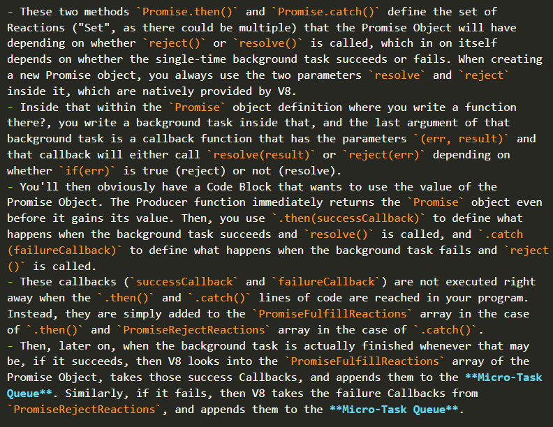
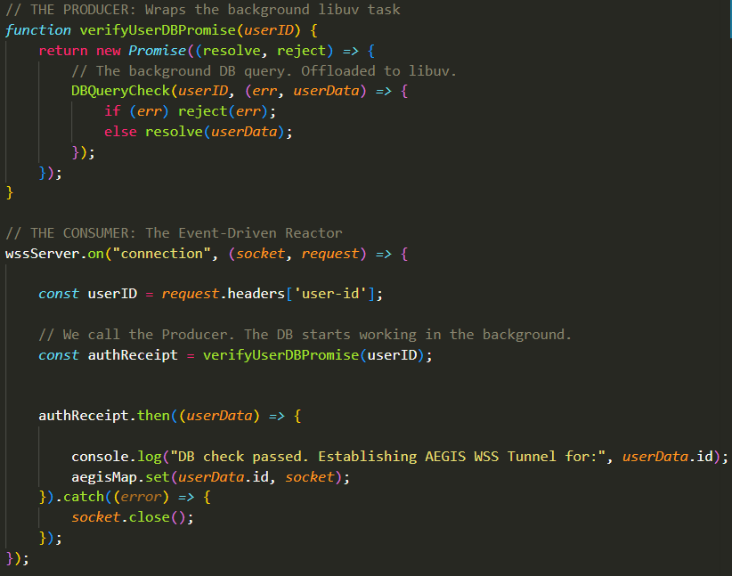

## Are Callbacks Synchronous or Asynchronous:
- As we know, the callback is literally just raw code passed as an argument to a function. It's a function passed as an argument to another function. That's it. In NodeJS, typically we refer to callbacks as functions that get executed whenever their corresponding background task gets fully executed in the background, but that's it. A callback has no inherent asynchronous properties.

- Later on, you'll understand why the distinction between a callback being Synchronous or Asynchronous really matters a lot, and how Promises play a big role here.

- The very important thing to note here is that whether a callback is Synchronous or Asynchronous depends entirely on its "Outer-function" (The function that receives the callback as an argument). The same callback function can either be Synchronous or Asynchronous depending on which function received it.
 - For example, if you pass a Callback to an Array, the Outer-Function executes the Callback 100% Synchronously, freezing the CPU in order to run.
 - However, if you pass that same Callback, with no difference whatsoeer, to `fs.readFile()`, the C++ bindings of THAT Outer-Function actually send it to the Event Loop (More on this later).

- Basically, the function that receives and executes the Callback dictates its status regarding whether it is Synchronous or Asynchronous. The difference between these is a very important one regarding when these Callbacks are executed as we'll see in a bit.

## The Run-To-Completion Principle:
- **This might be the absolute most important discussion so far. So pay attention:**

- The very second you start executing your NodeJS program by running `node server.js` in the terminal and clicking `Enter`, here's exactly what happens:

### Execution of Synchronous JS Code ONLY:
 - The Main Thread goes through the `server.js` file and **executes every single line of SYNCHRONOUS JS code one by one**. Any line of JS code that is CPU-blocking is executed right away. This includes spawning `worker` threads, opening ports, and even executing strictly Synchronous Callbacks. 
  - At this stage, when V8 reads `const worker = new Worker(...)`, the OS instantly allocates RAM and starts booting up a brand new CPU thread and V8 instance in the background. That worker immediately starts its own independent "Run-To-Completion" Principle in Parallel.
  - When V8 reads `wssServer.listen(443)` (We'll talk about this function later), `libuv` tells the Linux Kernel to open port 443. The kernel at this point opens it instantly.
  - When V8 reads `setTimeout(..., 500)`, the OS starts counting down those 500 milliseconds immediately from that point.
  - Let's say Port 443 was opened on like 50 of your `server.js` file, but your `server.js` file has 1000+ lines so the port is open, but the file hasn't been fully executed yet. What happens if a user connects during that window? The OS completes the TCP Handshake entirely in the kernel layer. The OS accepts the connection, takes the incoming packets, stores them in its own internal kernel buffer, and signals `libuv` that the data is ready. 
  - As you can see, the `OS` and `libuv` are very much active during this phase. They do their **Work** and do not wait for anything; Emphasis on the word "Work" because this will be very important in a bit.

### Disregard of All Asynchronous Callbacks:
 - During this initial "Run-To-Completion" run where the thread is only concerned with executing every single line of Synchronous JS code, it **entirely ignores every single Asynchronous Callback and just throws them into the Poll Queue of the Event Loop**. You see, **During This Initial Run of the file, The Event Loop is Entirely Frozen. Asynchronous Callbacks, when encountered, are lined-up in the Poll Queue, but are not executed at all**. 
 - So, every single "Asynchronous Reaction" is entirely ignored and thrown into the Poll Queue while the Event Loop remains completely frozen (Note that while the Event Loop is Frozen, any set timers are still being counted down by the OS, but even if the timer expires, nothing happens during this phase as the Event Loop is frozen).
 - Note that this is ONLY Asynchronous Callbacks. Any Synchronous Callback is still executed right then and there just like any other Synchronous JS code. 

 - This also brings up a very important distinction here. It is important to understand the difference between the **Work** and the **Reaction** to that work.
  - In the previous segment, we stated this: 

    "- Let's say Port 443 was opened on like 50 of your `server.js` file, but your `server.js` file has 1000+ lines so the port is open, but the file hasn't been fully executed yet. What happens if a user connects during that window? The OS completes the TCP Handshake entirely in the kernel layer. The OS accepts the connection, takes the incoming packets, stores them in its own internal kernel buffer, and signals `libuv` that the data is ready. "

 - As we know, accepting incoming packets is an Asynchronous background Task. So, shouldn't this Task be ignored and thrown into the Poll Queue instead of being executed right then and there during the Synchronous Code Execution Phase? 
  - You see, **Asynchronous Tasks are Different From Asynchronous Callbacks**.
  - Asynchronous Tasks (The OS/Hardware): Asynchronous Tasks run immediately in the background.
  
  - Asynchronous Callbacks (Reaction to JS Code): These are thrown into the Poll Queue and are forbidden from executing until the entire script finishes and the Event Loop starts.

   - You see, the line of code `socket.on("data", (packet) => {...})` INITIATES an Asynchronous Task (Which is the action of Listening in to incoming Packets to a Socket), but this itself is not a Callback. So, this is executed immediately. So, when a packet arrives, the background task of listening in to that packet is active and does take in the packet and its's placed into the kernel buffer. This is all background stuff and takes no CPU work.
   - HOWEVER, the callback `(packet) => {...}` in that function is an Asynchronous Callback. So, when the OS signals`libuv` that the data is ready after it has been received in the kernel buffer, the callback `(packet) => {...}` for each received packet is prepared by `libuv` then appended to the Poll Queue without being executed.

   - It does not matter if a `worker` thread finishes its script before the main one and sends a `PostMessage` back to the main thread. It does not matter if 5000 packets hit the server. Every single one of those Callbacks (**Reactions**) is shoved into the Poll Queue and has to wait until V8 finishes all the Synchronous Code first.

 - One last thing to state is that those Callbacks that get appended to the Poll Queue, those that are Asynchronous, are called **Macro-Tasks**. The Poll Queue is often referred to as the **Macro-Task Queue**

 ### Micro-Tasks and The Micro-Task Queue:
 - Lastly, there's this additional Queue we've never talked about before called the **Micro-Task Queue**, and yes this does imply the existence of a type of task called a **Micro-Task**.
 - We've actually mentioned this Queue before. Recall this discussion from the `Promises.md` file:
   

 - As you can see, the `callback`s defined within the `Promise.then(callback)` and `Promise.catch(callback)` which are invoked whenever the `Promise` object is either resolved (`resolve(successData)`) in the `.then()` case or rejected (`reject(err)`) in the `.catch()` case are so called **Micro-Tasks** and instead of being executed or put into the Poll Queue, they go into a completely distinct specialized Queue called the **Micro-Task Queue**.

 - During the initial Run-To-Completion Phase where only Synchronous JS Code is executed, all Promise Callbacks that are invoked during this phase are simply appended to the Micro-Task Queue and none of them are executed whatsoever. 
 - However, as soon as the Run-To-Completion Phase ends, **The Micro-Task Queue's Callbacks are all executed until the entire Micro-Task Queue is Emptied out. Only then is the Event-Loop un-frozen.**
 - So, the Micro-Task Queue with its Promise Callbacks is given absolute priority over the Macro-Task Queue of Standard Asynchronous Callbacks. 

## Why Promises and Why The Micro-Task Queue:

## Life After The Run-To-Completion Finishes:
- After The Macro-Task Queue's Callbacks (The Callbacks of The Promises) are all executed and the Queue is Emptied Out, at this point, the Synchronous JS Code of this file is fully executed, the Callbacks of the Promises are all executed, and the Event-Loop is un-frozen and finally comes to life. 

- At This Point, your Server is up and running completely with all variables initialized and operates strictly on a User-Event-Driven manner with nothing to execute other than Background Tasks and their corresponding Callbacks, with Event Listeners being the main-driver behind new Callbacks that get executed.
 - If a User Attempts To Connect To The Server, ........
 - If a User Clicks on GatherEvidence, that Event is Caught and .....
 - Whenever Packets are Hitting the Server, .......
 - Whenever .........

- One very important thing to note is that **Micro-Tasks Always Maintain Absolute Priority**. Even after the Run-To-Completion Phase is over, during any phase of the Event-Loop, **The V8 Engine checks the Micro-Task Queue after Every Single Macro-Task it executes.** So, if the Loop is in the Timers Phase and a Callback (Macro-Task) just got done executing, it will immediately check the Micro-Task Queue to see If any Promise has been Resolved/Rejected since the last time it checked. The same goes for the Poll, Check, Pending, and Close Phases. 

### AEGIS Scenario With Promises In The Event Loop:
- Imagine AEGIS is fully booted. The Event-Loop is spinning, and three users attempt to connect at the same millisecond. The OS catches all three TCP handshakes, three `wssServer.on("connection", callback)` events are caught, and their callbacks are dropped into the Poll Queue.
- Let's say inside the connection `callback`, we need to verify their JWT Token and Query the PostgreSQL Database. The database query takes 10 milliseconds and is wrapped in a promise (Meaning, the background task initiated by the Promise is the DB Query) as such:

   

 - 1. Execution of Macro-Task 1 (User A):
  - V8 Pulls User A's connection `callback` from the Poll Queue and runs it. The `callback` is that whole `(socket, request) => {...}` block. The JWT token is extracted from the `request` object and the `userID` is extracted from that. We then call the Producer function `verifyUserDBPromise` that returns the `Promise` object immediately to `authReceipt` and based on the given `userID` queries the DB to check if the User Exists. That `DBCheckQuery` starts getting executed in the background for 10 milliseconds. During this time, V8 is executing the remainder of User A's initial Callback, going over to the `.then()` and `.catch()` lines and appending their callbacks to the `PromiseFulfillResponse` and `PromiseRejectResponse` properties of the Returned, not-yet-valued `authReceipt` Promise Object.
 - 2. The Micro-Task Queue Check:
   - V8 Does not immediately move on to User B. Between every single Macro-Task, V8 freezes the Event Loop and looks at the Micro-Task Queue. Right now, it is empty (The database hasn't answered yet). So, V8 releases the Event Loop.
 - 3. Execution of Macro-Task 2 (User B):
   - V8 Pulls User B's callback from the `connection` event, hits the database query line, invokes the Producer Function `verifyUserDBPromise` to return the Promise and start a DB Check in the background, sets up the callbacks of the `.then()` and `.catch()` calls, and Finishes the callback. V8 Checks the Micro-Task Queue; Still empty.
 - 4. Micro-Task kicks-in:
  - While V8 is executing User C's callback, User A's database query finishes. The Promise is flipped to `"Fulfilled"` and drops User A's `.then()` callback into the Micro-Task Queue.
  - V8 finishes User C's initial callback. It checks the Micro-Task Queue.
 - 5. Micro-Task Execution:
  - V8 sees User A's Promise callback waiting. It completely halts the Event Loop. It pulls User A's Micro-Task and executes it Synchronously, which first outputs to the terminal that the connection was fully established, and adds the new user to the `aegisMap` containing all active users. 

## The Starvation Trap:
- Because V8 checks the Micro-Task Queue after every single Macro-Task, it gives you immense power to process internal logic immediately. But it comes with a lethal consequence.

- If User A's Promise callback has a bug, or intentionally contains a recursive Promise (a Promise that resolves and instantly spawns another Promise), V8 will sit in the Micro-Task Queue executing them one after another.

- The Event Loop is paralyzed.
 - If a fourth user tries to connect? The OS buffers it. If a timer expires? It sits in the Min-Heap. If an Evidence packet arrives? It gets stuck in the OS kernel. V8 will not execute a single Macro-Task until that Micro-Task Queue hits absolute zero. If you write an infinite Micro-Task loop, your server is dead, but your CPU usage will read 100% because V8 is grinding through infinite Promises.

 ### Why Promises are Necessary Even With The Starvation Risk: 
 - Despite the starvation risk, this mechanic is structurally required.

 - When User A's database query finishes, AEGIS needs to verify the JWT and either accept or reject the WSS connection immediately. If V8 put that .then() callback at the back of the Poll Queue, AEGIS would go process a thousand other network packets before it remembered to officially connect User A. User A's connection would time out on the client side.

 - The Micro-Task Queue allows V8 to say: "Pause the network intake. We just got the database answer for User A. Finish setting up User A's tunnel right now before we deal with anyone else."

 - The Micro-Task Queue allows us to really enforce a strict Chronological Ordering between a Background Task Executing, and its Corresponding Callback strictly occurring after it as soon as possible, while removing the chance of the Callback starting before the Background Task Finishes. 