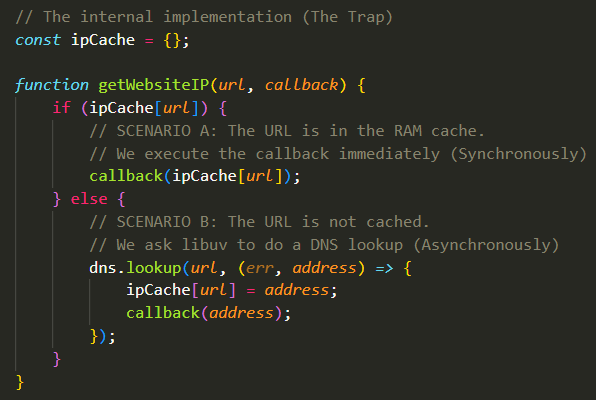
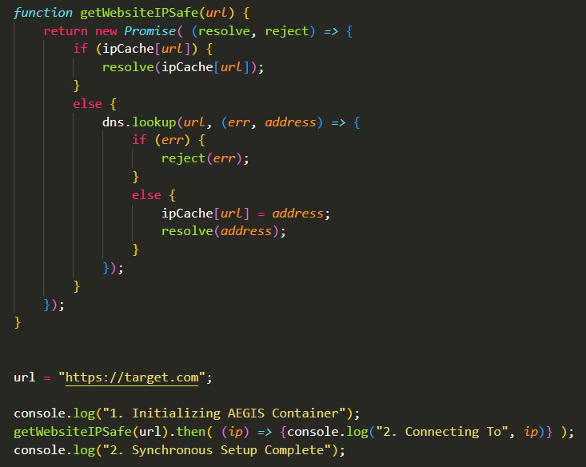

## Why Promises:
- You may be wondering by now why Promises even exist to begin with. We already had these Single-Task Callbacks through the "Error-First Convention" that we could just as easily, if not more easily, type that also fulfill the Single-Task Callback requirements that we want. 
- Why this mechanism of a "Variable That gets its value later" even exists.
- Additionally, you might be thinking, why on earth the callbacks of these Promises need their own Queue and why this whole mechanism of having their Micro-Task Queue be of such incredibly high priority even exists. 
- Truthfully, there exists a very big problem that Promises were made to solve. It's incredibly important to understand this problem and when to use Promises in order to avoid it. 

## Why A Variable That Gets its Value Later:
- Why not just a random variable. What's the point behind having a variable that gets immediately returned but later on gets its actual value? When discussing Promises in the `Promises.md` file, we briefly mentioned this, but never expanded upon it:

"""
- Imagine you have a variable that you want to pass into downstream functions (functions that are in the later lines of code) but the actual data for the variable does not exist yet.
 - You can't just pass the actual value (since it doesn't exist, you may not know what it is), nor can you pass the variable itself since it doesn't hold a value yet.
 - Therefore, you must pass an "Object that represents the future value". We call that object a "Promise". You can think of a Promise as an official legal placeholder, like a receipt. It states: "I don't have the data right now, but I PROMISE I will hold the space for it, and when the background work finishes, I will fill this object with the value, which you can use". 
 """

- Now, we can finally get to understand what that actually means now that we finally understand the difference between how V8 treats Synchronous and Asynchronous Code from our `ImportantDiscussion.md`. Consider this example:

 - Imagine we're writing the peice of code that hashes the file to get the `Final_Hash` that is then stored into the PostgreSQL Database:

    

 - Imagine NodeJS executed all of its code Synchronously. So, every operation is a CPU-Blocking operation, and we move through the lines of code one by one always. We only move to the next line to begin executing it if the one before it is finished executing fully. In this world where that is true, `Final_Hash` is a standard variable that holds hhe string value immediately because the main thread pauses, waits for the hashing to be done, and blocks everything until the hash is calculated. Everything works out just fine (Except, this would be incredibly slow in production, but at least no errors); The hash gets stored into the `Final_Hash` variable and only then do we perform the DB write operation with that `Final_Hash`.

 - However, we know that in reality, as we've previously discussed, for the sake of efficiency, the Hashing function should be an Asynchronous operation that runs in the background on a CPU that is different from the Main Thread one. Imagine `calculateAsyncHash` as a function that takes in the file and uses the NodeJS native `crypto.createHash("sha256")` method from the `crypto` module. This way, the hashing operation is executed by the `libuv` thread pool without spinning a whole `worker_thread` that would instantiate a whole new V8 Engine Copy (Isolate). 

    

 - The thing about doing this is that because `calculateHashAsync` offloads the work to the background `libuv` thread and returns immediately so the main thread doesn't freeze, the variable `FinalHash` **has nothing inside it yet. It will try to log it right away to the database and the operation will evaluate to `undefined`**. 

 - So, you wanna state that "Later on, strictly after the background operation (Of Hashing) finishes, I want this next operation (the database write) to use the data received from the background operation to operate on it". However, you if you do that with a normal variable, since the first line of code is Asynchronous and the Operation is a Background Operation, then the V8 Engine will offload the background operation to `libuv` and immediately attempt to perform the operation that requires the data before the data is even made available because the background operation is not done yet. 
 - The Question becomes **How do you pass a variable into downstream functions when the data for that variable does not exist yet?**

 - Truthfully, you could use Callbacks. You could have a Callback function for the Background Operation and within the Callback you could write all of the calls to the downstream functions over there. The Callback will capture the data of the background task and the callback will not run (therefore, the downstream functions calls will not be made) until the background task is fully done.
  - However, there exists problems with this Callback-dependent solution. For example, what if you want to use that variable holding the data returned from the background operation globally instead of it strictly being inside that Callback's scope? Depending on whether the Callback is considered Synchronous or Asynchronous changes a lot regarding when that Callback is executed as well. This is overall not a determinstic, consistent solution. Additionally, it has a chance at causing yet another problem that we'll discuss in a bit.

- The better and more elegant solution is to use `Promise` objects instead. You pass an object that represents the future value. When you call an Asynchronous Function (like `calculateHashAsync`), it instantly returns the Promise object; The Promise object will hold the space for the future value, and when the background work finishes, the object will take it. 
 - Now keep in mind that Promises do actually technically solve this problem also using Callbacks. When you setup the Producer function that returns the Promise, within the Callback function inside the Promise's Parameters, you define and run a background task; That Background Task will either succeed and return the `successData` or fail and return an `err`. Then, depending on the result, either `resolve(successData)` or `reject(err)` are called. These two calls then respectively will cause the Callbacks of `.then()` or `.catch()` to be appended to the **Micro-Task** Queue. **Since the Callbacks in the Micro-Task Queue will only ever be called AFTER the whole Synchronous JS Script is done with (and at that point, since the callbacks are in the Micro-Task Queue, it means that the Background Task is already fully complete), then this problem where we make a Call to a Function before the data it needs is ready is fully eliminated.

 - So, while it may seem like both Solutions just end up using Callbacks to Solve the problem anyway, Promises are still the better way to go. As you can see, **the Promise Method Strictly Pushes These Callbacks to the Micro-Task Queue. Meanwhile, the standard Callbacks method will, depending on whether the Callback is Asynchronous or not, either add those Callbacks to the Macro-Task Queue OR If they're Synchronous, will just execute them right away.**
  - Due to this difference in what happens for each type of callback, Promises actually help us solve the **Schrodinger's Callback (Zalgo) Problem** and it also helps us enforce a **Logical Continuation Of Tasks**. 
 
 
## Schrodinger's Callback Problem (Zalgo's Problem):
- You should by now be familiar with how different it is whenever a Callback is Synchronous or Asynchronous in terms of how it's treated and when it's executed.
 - Synchronous Callbacks: Execute right away Synchronously just like any other custom JS code. 
 - Asynchronous Callbacks: Get Thrown into the end of the Poll (Macro-Task) Queue to be executed in the Poll Phase of the Event Loop.

- Recall that we discussed how **The Synchronousness of a Callback Depends on The "Outer" Function That Receives It**. So, the same Callback function could be Synchronous when received by one function and Asynchronous when received by another.
 - For example, if you pass a Callback to an Array, the Outer-Function executes the Callback 100% Synchronously, freezing the CPU in order to run.
 - However, if you pass that same Callback, with no difference whatsoever, to `fs.readFile()`, the C++ bindings of THAT Outer-Function actually send it to the Event Loop.

- "Releasing Zalgo" is a problem coined by the creator of `npm` to describe **A Function that Unpredictably Does Both**. I like to call it **Schrodinger's Callback because Sometimes The Outer Function Executes it Synchronously, and Sometimes That Same Outer Function Executes That Same Callback Asynchronously. The Callback is in this Non-Deterministic State where it is unpredictably sometimes Synchronous and Sometimes Asynchronous.** It's important to understand why and how this happens.

 - Imagine you're trying to be smart and write very optimized code. So, when you write the function `getWebsiteIP` that gets the IP address of the Target Website and calls some blackbox `callback` function on it, you write it such that before it tries fetching the `IP` through a `DNS lookup`, it first checks if the `IP` of that `url` already exists in the Internal `ipCache` or not for an even faster lookup. 
 - Here's the function shown below (Note that to make the explanation more understandable, an `ipCache` object was made to hold (url : address) pairs, but obviously this isn't the actual internal IP Cache Implementation but a demonstration that works because a lookup of this local object is still much faster than an entire DNS Lookup):

   

 - Here's the thing to notice about the two scenarios that could occur depending on whether the current `url`'s IP Address is already in the `ipCache` or not:
  - If The IP is in the Cache: `callback(ipCache[url])` is immediately executed Synchronously right then and there just like any other standard JS code. 
  - If The IP is NOT in the Cache: we first have to call `dns.lookup(url)` which is a fully asynchronous background operation that is offloaded to `libuv`, and then in the callback of that background task lookup if we receive the address after the background operation is done, we log that (url : address) pair into the `ipCache` and then call the `callback(address)` on that IP.
   - To understand what's going on, first realize that in this scenario you actuall have two distinct callbacks:

    - The Anonymous Callback: `(err, address) => {.....; callback(address);}`
    - The Named Callback: `callback(adddress)`

   - When V8 reads the `dns.lookup()` line, it knows that `dns.lookup()` is an Asynchronous background operation. So, since `dns.lookup()` is Asynchronous, then by default its callback `(err, address) => {...}` is also Asynchronously Executed. So, after the `dns.lookup()` background task is done, the Anonymous Callback is dropped into the Macro-Task (Poll) Queue.
   - This means that the Named Callback `callback(address)` is effectively **Taken Hostage** because it is called INSIDE the Anonymous Callback, it cannot execute until the Anonymous Callback executes. 

   - Here's a timeline of what happens in this Scenario:
    - `dns.lookup()` sends the work to `libuv` so the lookup is done in the background.
    - V8 finishes `getWebsiteIP` and moves on to the rest of the file.
    - The "Run-To-Completion" phase ends.
    - The Event Loop Starts.
    - 50ms Later, `libuv` finishes the DNS query and drops the Anonymous Callback into the Poll Queue (The receiver function `dns.lookup()` is Asynchronous so its callback `(err, address) => {...}` is also Asynchronous).
    - The Event Loop pulls the Anonymous Callback and starts executing it on the Main Thread.
    - V8 runs `ipCache[url] = address;` synchronously.
    - V8 runs the named callback `callback(address)` synchronously right then and there.

   - From the prespective of the Event Loop inside the Poll Phase, `callback(address)` is running synchronously. but from the prespective of the main `server.js` file, it **ran asynchronously** as it executed 50 milliseconds after the whole file finished executing instead of it executing during the Run-To-Completion Phase with other asynchronous code. 
   - Constrast this with Scenario A where there is a Cache Hit
    - V8 sees `if (ipCache[url])` and it evaluates to true.
    - V8 immediately executes `callback(ipCache[url])`.
    - V8 moves on to the rest of the file.

   - In Scenario "A", the Named Callback is executed during the Run-To-Completion Phase (Synchronously relative to the file). In Scenario "B", the Named Callback is executed during the Poll Phase, 50ms after the Run-To-Completion Phase is over (Asynchronously relative to the file).

- This is **Schrodinger's Callback**. The function `getWebsiteIP` has you passing a `callback` to it, but it doesn't guarantee WHEN it will execute that callback. If the downstream code in the main file relies on data provided by `callback`, it will crash 50% of the time depending on whether the execution path took Scenario "A" (executed before the downstream code) or Scenario "B" (executed AFTER the downstream code). A Simple Cache Hit completely inverts the execution of the file.

- **The Synchrousness Of A Callback Is Typically Inherited From The Receiver Function That Takes In That Callback As An Argument. If The Receiver Function is Asynchronous (e.g., A Call To A Background Task), Then The Callback Should Execute Asynchronously As Well. If The Receiver Function is Synchronous (e.g., Contains Custom JS Code), Then The Callback Should Be Executed Synchronously Too.** 
 - **However, If Your Receiver Function is Synchronous, but Within It, It Calls An Asynchronous Background Task (e.g., How `getWebsiteIP` is Synchronous but `dns.lookup()` is Asynchronous), and Within The Callback Of That Asynchronous Task You Call The Received, Original `callback` There, Then Relative To The File Itself, The `callback` Will Be Executed Asynchronously Because It Was Taken Hostage By The Asynchronous Callback Of The Asynchronous Background Task.**
 - **This Can Be Predictable If The Receiver Function will deterministically ALWAYS call the Asynchronous Task, but if There Is Something (Like a Cache Hit or Miss) that May Cause It To Sometimes Be Called Right Away (Synchronously) and Sometimes Be Called WITHIN The Asynchronous Background Task's Callback, Then It Becomes Ambiguous and You Can Never Know For Certain When This Callback Will Be Executed.**

- If you know that your function is ALWAYS asynchronous, you know exactly how to write your code: **You Put All The Downstream Logic That Depends On It The Data Of The Callback INSIDE The Callback Of That Function So That The Downstream Logic Is Only Executed If The Background Task Is Done.**
- If you know that your function is ALWAYS synchronous: **You Put All Your Downstream Logic BELOW that function, because you know the function will blockc the thread and finish and get the result before moving down.**
- The Catastrophe only occurs when you write a branching function (like a cache check) that violates this 100% certainty, and you have no idea where to place this downstream code. 

 ### How Promises Fix This: 
 - **A Promise strictly enforces the ALWAYS Asynchronous** Case. If you wrap your branching function in a Promise, Even If The Data is Immediately available (which would normally trigger a synchronous callback), the callback is still thrown into the Micro-Task Queue and is NEVER executed Synchronously right as the Micro-Task Queue is ONLY checked after the Run-To-Completion Phase is Done. 
 - By Artificially delaying the cache-hit callback, the Promise Guarantees that from "the grand scheme of the file itself", the callback is ALWAYS executed Asynchronously. The unpredictability caused by the branching is completely destroyed as the If-Statement itself, since it's inside the callback which is inside the `.then()` case of a Promise, is never checked until the whole file is executed anyway. The branching no longer has a say in the synchrousness of the callback as it will never execute synchronously.
 - Consider The Following Snippet Which Uses Promises:

   

 - Here's What Happens in Scenario "A" (Cache Hit):
  - The `url` string is defined (This is for demonstration purposes.)
  - The output of the `console.log("1. Initializing AEGIS Container")` is written.
  - The "Producer" Function `getWebsiteIPSafe` is called.
  - The "Producer" Function `getWebsiteIPSafe` only takes in the `url`, not the callback. 
  - If The IP is already in `ipCache`, then `resolev(ipCache[url])` is executed instantly.
  - However, `resolve()` does not execute the `.then()` callback. All it does is flip the `PromiseState` from `pending` to `fulfilled` and places the IP result into `PromiseResult`.
  - When The State Flips to `fulfilled`, V8 takes the `.then()` callback and throws it into the Micro-Task Queue. 
  - The Main Thread is completely unlocked. It moves to the next line, prints `2. Synchronous Setup Complete`, and finishes the file. The Run-To-Completion Phase is over.
  - Only when the file is done does V8 empty the Micro-Task Queue and execute the callback of the `.then()` statement which prints `3. Connecting To {ip}`.
  - Correctly, the output is: 1, 2, 3.

 - Here's What Happens in Scenario "B" (Cache Miss):
  - The `url` string is defined (This is for demonstration purposes.)
  - The output of the `console.log("1. Initializing AEGIS Container")` is written.
  - The "Producer" Function `getWebsiteIPSafe` is called.
  - The "Producer" Function `getWebsiteIPSafe` only takes in the `url`, not the callback. 
  - If the IP is NOT in the Cache, `dns.lookup()` executes and hands the work to `libuv`. The Promise remains `pending`.
  - The main thread is unbothered, moves to the next line and prints `2. Synchronous Setup Complete`.
  - At This Point. The Entire Synchronous File Is Executed. The Run-To-Completion Phase is over. The Micro-Task Queue is checked, at this point it's still empty. So, the Event Loop now comes to life.
  - 50 milliseconds later, `libuv` finishes the DNS Lookup. The Event Loop pulls the DNS callback into the Poll Phase. It executes `resolve(address)`. 
  - The state flips to `fulfilled`. V8 takes then `.then()` callback and throws it into the Micro-Task Queue.
  - After The Current Macro-Task is done, the Micro-Task Queue is checked again and the `.then()` callback is found. 
  - The Event Loop freezes, empties the Micro-Task Queue, and prints `3. Connecting to {ip}`.
  - Correctly, the output is: 1, 2, 3.

- The Outputs are Identical. The Promise Architecture prevents the branching logic from having a say in the synchronousness of the Callback and stops the Cache Hit from executing the callback synchronously. 

## Enforcing A Logical Continuation: 
- Remember this code from the `ImportantDiscussion.md` file? 

- Imagine AEGIS is fully booted. The Event-Loop is spinning, and three users attempt to connect at the same millisecond. The OS catches all three TCP handshakes, three `wssServer.on("connection", callback)` events are caught, and their callbacks are dropped into the Poll Queue.
- Let's say inside the connection `callback`, we need to verify their JWT Token and Query the PostgreSQL Database. The database query takes 10 milliseconds and is wrapped in a promise (Meaning, the background task initiated by the Promise is the DB Query) as such:

   

 - 1. Execution of Macro-Task 1 (User A):
  - V8 Pulls User A's connection `callback` from the Poll Queue and runs it. The `callback` is that whole `(socket, request) => {...}` block. The JWT token is extracted from the `request` object and the `userID` is extracted from that. We then call the Producer function `verifyUserDBPromise` that returns the `Promise` object immediately to `authReceipt` and based on the given `userID` queries the DB to check if the User Exists. That `DBCheckQuery` starts getting executed in the background for 10 milliseconds. During this time, V8 is executing the remainder of User A's initial Callback, going over to the `.then()` and `.catch()` lines and appending their callbacks to the `PromiseFulfillReactions` and `PromiseRejectReactions` properties of the Returned, not-yet-valued `authReceipt` Promise Object.
 - 2. The Micro-Task Queue Check:
   - V8 Does not immediately move on to User B. Between every single Macro-Task, V8 freezes the Event Loop and looks at the Micro-Task Queue. Right now, it is empty (The database hasn't answered yet). So, V8 releases the Event Loop.
 - 3. Execution of Macro-Task 2 (User B):
   - V8 Pulls User B's callback from the `connection` event, hits the database query line, invokes the Producer Function `verifyUserDBPromise` to return the Promise and start a DB Check in the background, sets up the callbacks of the `.then()` and `.catch()` calls, and Finishes the callback. V8 Checks the Micro-Task Queue; Still empty.
 - 4. Micro-Task kicks-in:
  - While V8 is executing User C's callback, User A's database query finishes. The Promise is flipped to `"Fulfilled"` and drops User A's `.then()` callback into the Micro-Task Queue.
  - V8 finishes User C's initial callback. It checks the Micro-Task Queue.
 - 5. Micro-Task Execution:
  - V8 sees User A's Promise callback waiting. It completely halts the Event Loop. It pulls User A's Micro-Task and executes it Synchronously, which first outputs to the terminal that the connection was fully established, and adds the new user to the `aegisMap` containing all active users. 

 - When User A's database query finishes, AEGIS needs to verify the JWT and either accept or reject the WSS connection immediately. If V8 put that .then() callback at the back of the Poll Queue, AEGIS would go process a thousand other network packets before it remembered to officially connect User A. User A's connection would time out on the client side.

 - The Micro-Task Queue allows V8 to say: "Pause the network intake. We just got the database answer for User A. Finish setting up User A's tunnel right now before we deal with anyone else." This way, User A's Tunnel Setup (Or Crash) does not get delayed by thousands or millions of incoming packets instead of it being resolved immediately. 

- When AEGIS receives a WSS packet from a user, that is a Macro-Task. V8 starts processing it. If the code queries a database to verify a JWT, it wraps that query in a Promise.
- When the database query finishes, that `.then()` callback is the direct, logical continuation of that specific user's packet. It is the same train of thought.
- If V8 threw that `.then() `callback into the Macro-Task Poll Queue, the server would go process thousands of packets from other users before it finally got around to finishing the JWT verification for the first user.

## When To Use Promises:
- Every single time you want to setup a Single-Task Operation, Always use Promises. The "Error-First Convention" method is practically dead in modern NodeJS.

- For Single-Task Operations: ALWAYS Use Promises:
 - If a background task happens exactly once (e.g., querying a database, hashing a file, fetching an IP, authenticating a user), you must use only promises.
 - Using an Error-First callback for a single-task operation introduces unnecessary Zalgo risks, Callback Hell (Where there is extreme nesting of callbacks that creates a callback pyramid), and breaks `async/await` compatibility (more on this later).

- For Continuous Streams: NEVER Use Promises:
 - A Promise is like a state machine that settles exactly once and is permanently frozen. If you're dealing with a persistent WSS connection, a TCP Socket, or a live video feed, the background task emits hundreds of times if not more. A Promise cannot handle this because it cannot "resolve" 500 times. 
 - For continuous streams, you use the `EventEmitter` pattern (e.g., `socket.on("data", callback)`) where the callbacks sit in the Macro-Task Poll Queue and fires repeatedly every time the OS Buffer is hit with a packet. 

- Now, you can say that:
 - **Promise Callbacks are Micro-Tasks**.
 - **EventEmitter Callbacks are Macro-Tasks**.

