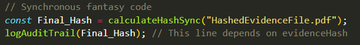
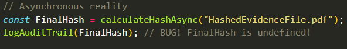

## Why Promises:
- You may be wondering by now why Promises even exist to begin with. We already had these Single-Task Callbacks through the "Error-First Convention" that we could just as easily, if not more easily, type that also fulfill the Single-Task Callback requirements that we want. 
- Why this mechanism of a "Variable That gets its value later" even exists.
- Additionally, you might be thinking, why on earth the callbacks of these Promises need their own Queue and why this whole mechanism of having their Micro-Task Queue be of such incredibly high priority even exists. 
- Truthfully, there exists a very big problem that Promises were made to solve. It's incredibly important to understand this problem and when to use Promises in order to avoid it. 

## Why A Variable That Gets its Value Later:
- Why not just a random variable. What's the point behind having a variable that gets immediately returned but later on gets its actual value? When discussing Promises in the `Promises.md` file, we briefly mentioned this, but never expanded upon it:

"""
- Imagine you have a variable that you want to pass into downstream functions (functions that are in the later lines of code) but the actual data for the variable does not exist yet.
 - You can't just pass the actual value (since it doesn't exist, you may not know what it is), nor can you pass the variable itself since it doesn't hold a value yet.
 - Therefore, you must pass an "Object that represents the future value". We call that object a "Promise". You can think of a Promise as an official legal placeholder, like a receipt. It states: "I don't have the data right now, but I PROMISE I will hold the space for it, and when the background work finishes, I will fill this object with the value, which you can use". 
 """

- Now, we can finally get to understand what that actually means now that we finally understand the difference between how V8 treats Synchronous and Asynchronous Code from our `ImportantDiscussion.md`. Consider this example:

 - Imagine we're writing the peice of code that hashes the file to get the `Final_Hash` that is then stored into the PostgreSQL Database:

    

 - Imagine NodeJS executed all of its code Synchronously. So, every operation is a CPU-Blocking operation, and we move through the lines of code one by one always. We only move to the next line to begin executing it if the one before it is finished executing fully. In this world where that is true, `Final_Hash` is a standard variable that holds hhe string value immediately because the main thread pauses, waits for the hashing to be done, and blocks everything until the hash is calculated. Everything works out just fine (Except, this would be incredibly slow in production, but at least no errors); The hash gets stored into the `Final_Hash` variable and only then do we perform the DB write operation with that `Final_Hash`.

 - However, we know that in reality, as we've previously discussed, for the sake of efficiency, the Hashing function should be an Asynchronous operation that runs in the background on a CPU that is different from the Main Thread one. Imagine `calculateAsyncHash` as a function that takes in the file and uses the NodeJS native `crypto.createHash("sha256")` method from the `crypto` module. This way, the hashing operation is executed by the `libuv` thread pool without spinning a whole `worker_thread` that would instantiate a whole new V8 Engine Copy (Isolate). 

    

 - The thing about doing this is that because `calculateHashAsync` offloads the work to the background `libuv` thread and returns immediately so the main thread doesn't freeze, the variable `FinalHash` **has nothing inside it yet. It will try to log it right away to the database and the operation will evaluate to `undefined`**. 

 - So, you wanna state that "Later on, strictly after the background operation (Of Hashing) finishes, I want this next operation (the database write) to use the data received from the background operation to operate on it". However, you if you do that with a normal variable, since the first line of code is Asynchronous and the Operation is a Background Operation, then the V8 Engine will offload the background operation to `libuv` and immediately attempt to perform the operation that requires the data before the data is even made available because the background operation is not done yet. 
 - The Question becomes **How do you pass a variable into downstream functions when the data for that variable does not exist yet?**

 - Truthfully, you could use Callbacks. You could have a Callback function for the Background Operation and within the Callback you could write all of the calls to the downstream functions over there. The Callback will capture the data of the background task and the callback will not run (therefore, the downstream functions calls will not be made) until the background task is fully done.
  - However, there exists problems with this Callback-dependent solution. For example, what if you want to use that variable holding the data returned from the background operation globally instead of it strictly being inside that Callback's scope? Depending on whether the Callback is considered Synchronous or Asynchronous changes a lot regarding when that Callback is executed as well. This is overall not a determinstic, consistent solution. Additionally, it has a chance at causing yet another problem that we'll discuss in a bit.

- The better and more elegant solution is to use `Promise` objects instead. You pass an object that represents the future value. When you call an Asynchronous Function (like `calculateHashAsync`), it instantly returns the Promise object; The Promise object will hold the space for the future value, and when the background work finishes, the object will take it. 
 - Now keep in mind that Promises do actually technically solve this problem also using Callbacks. When you setup the Producer function that returns the Promise, within the Callback function inside the Promise's Parameters, you define and run a background task; That Background Task will either succeed and return the `successData` or fail and return an `err`. Then, depending on the result, either `resolve(successData)` or `reject(err)` are called. These two calls then respectively will cause the Callbacks of `.then()` or `.catch()` to be appended to the **Micro-Task** Queue. **Since the Callbacks in the Micro-Task Queue will only ever be called AFTER the whole Synchronous JS Script is done with (and at that point, since the callbacks are in the Micro-Task Queue, it means that the Background Task is already fully complete), then this problem where we make a Call to a Function before the data it needs is ready is fully eliminated.

 - So, while it may seem like both Solutions just end up using Callbacks to Solve the problem anyway, Promises are still the better way to go. As you can see, **the Promise Method Strictly Pushes These Callbacks to the Micro-Task Queue. Meanwhile, the standard Callbacks method will, depending on whether the Callback is Asynchronous or not, either add those Callbacks to the Macro-Task Queue OR If they're Synchronous, will just execute them right away.**
  - Due to this difference in what happens for each type of callback, Promises actually help us solve the **Schrodinger's Callback (Zalgo) Problem** and it also helps us enforce a **Logical Continuation Of Tasks**. 
 
 
## Enforcing A Logical Continuation:

## Schrodinger's Callback Problem (Zalgo's Problem):

