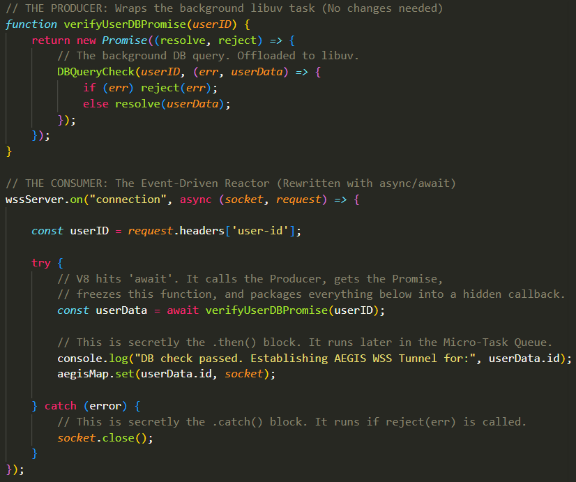

## What are `async` and `await`:
- These are statements used in Modern NodeJS to deal with Promises. Using them provides no functional advantage over using Promises the way we learned whatsoever. They are only used syntactically to make the code look more neat, linear, and less nested.
- Remember how we used to write those Blocks of Code outside the Producer Function in something that we called the "Consumer Block" that would define the success callbacks and failure callbacks of a Promise through `.then()` and `.catch()` calls respectively on that returned Promise Object? Then, when these statements are encountered in your code, their callbacks would be stored into the `PromiseFulfillReactions` and `PromiseRejectReactions`, to be placed in the Macro-Task Queue whenever either `resolve(data)` or `reject(err)` respectively are called from within the Promise Object after the Background Task is done?
- Well, that block was a bit ugly. It had us writing `.then()` statements with full callbacks inside them and you'd have one of these for every single callback you wanted to attach to that Promise Object. 
- Instead, these two statements aim to make things a little less ugly by **Making this "Consumer" Block sit inside a function which neatly sets up these Callbacks of The Object Received From The Producer and After Setting Up That Promise It Returns It.**
- We'll first explain `async` and `await` generally as keywords and then look at how they are typically used.


### `async`:
-  The `async` keyword is applied to the declaration of a function. It serves exactly one purpose. **It forces the function to return a Promise Object, no matter what**. 
- If you write a function that returns a raw string, and you put `async` in the front of it, V8 will instantiate a new Promise Object, flip its state to `Fulfilled`, and drop that string into the `PromiseResult` property of the Promise and returns the Promise Object instead of the raw string.
- For example, if you write:

```
async function getSystemStatus(){
    return "AEGIS_ONLINE";
}
```
What V8 actually executes is more like this:

```
function getSystemStatus(){
    return Promise.resolve("AEGIS_ONLINE");
}
```

- If the function throws an error, V8 intercepts the crash, instantiates a Promise, flips it to `Rejected`, drops the error stack trace into `PromiseResult`, and returns that Promise Object.

- `async` guarantees that anyone calling this function will receive a Promise, never a raw value or a crash object. This will be important later on.

### `await`:
- The `await` keyword can strictly only be used inside functions which have the `async` keyword in their declaration header. 
- The `await` keyword expects a Promise on its right hand side. Otherwise, it will not work. This Promise Object is expected to actually be received from the Producer Function Call and not be instantiated there manually inside this `async` function.
- Additionally, after that Promise Object either gets Resolved or Rejected (What matters is that it's no longer in a `pending` state but either `fulfilled` or `rejected`), the `await` statement will actually unwrap that returned Promise Object and will return only its `PromiseResult` value and not the whole Promise object. 

```
const data = await ProducerFunction(...);
```

- Where `data` is a standard variable holding the value of `PromiseResult` of the Promise Returned by `ProducerFunction(..)` after the Promise has been flipped into either a `fulfilled` or `rejected` state.

- The most important thing about `await` is that it splits the `async` function in half. Every single line of code within the `async` function that appears after the `await` line is actually bundled together into this hidden anonymous callback. This anonymous callback becomes the callback of the Promise Object returned from `ProducerFunction(..)` in the case of a successful background operation.
 - Basically, this becomes the replacement to the `.then()` statement. Instead of saying `Promise.then( (successData) => {...})`, all of these lines under the `await` statement are bundled together into the callback of the Promise whenever its background task succeeds.
 - So, the lines of code under the `await` statement are treated as a callback and are all put in the `PromiseFulfillReactions` field of the Promise Object. If the background task succeeds, that whole block is moved into the Macro-Task Queue and executed.

- So, what about `.catch()`? What's it's replacement? Well, since you can't really call `.catch()` because `await` unwraps the Promise and you only have a standard varaible, to handle the `reject(err)` case, literally all you do is just use `try/catch` blocks inside the `async` function. If the `ProducerFunction(..)` call returns a Promise that's in the `Rejected` state and is holding an error stack in its `PromiseResult` (Because `ProducerFunction(..)` called `reject(err)`), when `await` unwraps that and tries to dump it into the variable `data` on the left-hand-side, the `try/catch` block will catch that. 
- Then, the code written in the `catch` block is actually the callback for the failed case. The `catch` statement catches the Error Stack Trace (`err`) and its block is now the replacement for the `.catch()` statement. The code in the `catch` block is bundled into a hidden callback that's written to the `PromiseRejectedReactions` field of the Promise Object. 


## How They are Implemented:
- First, you have to realize, that these two statements have no effect on the "Produer Function" that produces the Promise itself. These are mainly used only to prettify the "Consumer" block that sets the Micro-Tasks of the Promise up. 
- So, the `ProducerFunction` still immediately writes `return new Promise( (resolve, reject) => {...} )` with this `(resolve, reject) => {...}` callback in its constructor to provide the `resolve` and `reject` functions to us. Then, inside this it calls some Background Single-Task which in turn has its own `(data, err)` callback that will either call: `reject(err)` or `resolve(data)` after the background task is finished. 


- Whenever you call this `async` function, it calls the `ProducerFunction` to provide it with the `Promise Object`.
- The `ProducerFunction` instantiates the Promise Object, immediately returns the `pending` Promise object to the caller (`async`) function, and Calls the Background Task. 
- Execution goes back to the caller, which is the `async` function. It takes the entirety of the block of code under the `await` statement, bundles it into a callback (This callback also takes in the `successData` output of the successful background task as input), then this callback is written into the `PromiseFulfillReactions` field of the returned Promise Object. Similarly, the code in the `catch` block is bundled into the failed-case callback and written into the `PromiseRejectReactions` field of the Promise Object. 
- The `async` function suspends its own execution. It saves all of these location variales into the memory heap.
- Sometime later (e.g., 50ms), the background task finishes. The producer's internal callback fires and calls `resolve(successData)`.
- This flips the Promise State to `fulfilled` and places `successData` into the `PromiseResult`. Then, the hidden bundled callback within `PromiseFulfillReactions` is thrown into the Micro-Task Queue.
- V8 halts Event Loop execution between Macro-Tasks to check the Micro-Task Queue. It finds that callback. V8 then restores the `async` function's variables from memory, extracts the `successData` from the promise, assigns it to the variale `data` you placed on the left side of the `await` keyword, and resumes executing the rest of the function (which is the callback) synchronously.
- If the background task fails, the `ProducerFunction` calls `reject(err)`. V8 takes the hidden callback bundled from the `catch` block (stored in `PromiseRejectReactions`) and throws that into the Micro-Task Queue. When execution of the `async` function resumes, the error is returned but as soon as the Promise object is unwrapped by the `await` statement, the error is "detonated" and thrown, forcing the execution into the `catch` block.


- As you can see, the `async` and `await` keywords, if you abstract away all the Promise Logic for a bit, look like they're essentially putting the `async` function "on hold" due to asynchronous background tasks, which is exactly why these keywords were called `async` and `await`. 
 - If you just ignore all of the background stuff happening with promises, it seems like what's happening is that the `async` function is an `asynchronous` function that instead of doing its work right then and there fully synchronously, it's offloading all of its work later on to the Micro-Task Queue (The Statements under `await` are all in fact thrown into a callback in the Micro-Task Queue). So, it gives the illusion of you making the function asynchronous by just writing `async` at the top of it.
 - Similarly, the `await` statement does give the illusion of this function AWAITING the (producer) function being called right next to it to finish its execution before it goes through with executing the remainder of this code (The remainder of the code has been bundled into a callback that is called after the background task called in the producer function is done, but this is a Micro-Task type of callback. So, it seems like it happens immediately after instead of being thrown into the Macro-Task Queue and being executed potentially way later). This gives the illusion that you're telling your function to freeze execution untilt he other one finishes. 


## Traced Async/Await Example:
- Remember this code snippet we've previously discussed? 

   

- Well, now let's use async/await syntax to see how it will look:

   


- 1. The Event Loop is in the Poll Phase. A new TCP connection is made, the `wssServer.on("connection", ...)` callback is sent to the Macro-Task (Poll) Queue, several Macro-Tasks later, it reaches this callback and starts executing is synchronously line by line. It first extracts the `userID` from the HTTP Request. 
- 2. Because this callback of the `wssServer.on("connection")` Background Single-Task is the "Consumer", that callback is actually made into the `async` function and given the `async` keyword in its declaration (Yes, this keyword can obviously be used on anonymous functions as well).
- 3. V8 reaches the `await verifyUserDBPromise(userID)` line. It puts the callback "on hold" and goes on to execute the "Producer Function", which is the `verifyUserDBPromise` function. The Producer immediately returns a `Promise` object in the `pending` state, and in the Producer Function, the `DBCheckQuery` is the Single-Task Background Task that is offloaded to `libuv` to execute in the background.
- 4. Due to the `await` keyword, V8 fully halts the execution of this callback and stores the local variables of it (`socket`, `request`, `userID`) into the memory heap. Every Single Line of Code under the `await` line (Sandwhiched Between The `try` and `catch` Statements) is bundled into a callback function that is added to the `PromiseFulfillReactions` array of the Promise Object. Similarly, the lines of code inside the `catch` block are bundled into a callback that is added to the `PromiseRejectReactions` array of the Promise Object. 
- 5. V8 immediately exits the `wssServer.on(...)` function and its entire block, returning control to the Event Loop. The Event Loop is now free to process the connection for User B, even though User A's function is only half-finished. 
- 6. 10 milliseconds later, `libuv` finishes the `DBQueryCheck` background task, this appends its `(err, userData) => {...}` callback to the Poll Queue. Eventually, `resolve(userData)` is called, which immediately flips the state of the Promise Object to `Fulfilled`. Also, the `PromiseResult` field now holds the data of the user returned from the background DB operation.
- 7. As Soon as `resolve()` is called, the bundled callback within `PromiseFulfillReactions` is immediately appended to the Micro-Task Queue. The Event Loop finishes whatever Macro-Task it was currently executing, checks the Micro-Task Queue, and finds this callback.
- 8. V8 halts the Event Loop and begins executing the callback. It restores the local variables (`socket`, `request`, `userID`) from the heap. It unwraps the Promise, extracts the user data from the `PromiseResult` field, and assigns it to `const userData`. The Promise Object is fully destroyed.
- 9. V8 continues executing the remainder of that callback (The code sandwhiched between the `try` and `catch` statements). It prints the `console.log` statements, adds the user to the `aegisMap`, and the function officially completes. The Event Loop is unfrozen and returns to Processing the Poll Queue. 

- Again, nothing different from what would happen had you just used standard Promises,but it does make the "Consumer" block look neater. Also, it avoids a problem called **Callback Hell** where you write many promises or callbacks nested within each other to the point where you make a very slanted, ugly, un-readable pyramid of callbacks.


## Why Does The `async` Function Always Return A Promise?
- One of the first things we stated here is that the `async` statement primarily has a singular functionality. It ensures that the function with `async` in its declaration is forced to return a `Promise` object, even if it tries to return a primitive value. However, we never really discussed why that's important at all.
- In our previous worked example where we say the trace through the `verifyUserDBPromise()` Producer and the `wssServer.on()` async/await statements, this idea of the "Consumer" function returning a Promise didn't come into play at all, and that's because it simply did not matter here because the "Consumer" (`async`) function was called by an external event that happened in the background (The `connection` event). In fact, the `async` "Consumer" function was just a Callback.
- This idea of `async` "Consumer" functions returning a Promise only matters whenever the `async` function is called by another function instead. 
 - If another function is calling the `async` function, chances are is expects a returned value from the `async` function. It wants something from it.
 - However, when the `async` function is called and V8 sees the `await` statement and slices that Consumer function in half, packages the bottom half into the Micro-Task Queue, it also **returns control to whoever called the Consumer**. 
 - So, the `async` function is not done fully executing (Because its bottom half under the `await` keyword is still waiting for the background task to finish before it executes), but execution has already gone back to the function that called the `async` function that EXPECTS a returned value from it.
 - So, what does V8 hand back to the caller? It cannot hand back the final result, obviously because the bottom half of the function hasn't executed yet. Therefore, you know the answer, it must hand back a Promise object.

- **the await keyword is contagious. If you want to consume data from an async function, the caller must also use await (and therefore must also be async). The "suspension" creates a chain reaction that travels all the way up to the absolute top of your application (the route handler or websocket listener), allowing the entire vertical slice of your backend to pause in memory while the CPU goes to do other things.**

- Irrespective of AEGIS, imagine this scenario for a login process:
 - 1. A `Route Handler` calls the `Auth Controller`.
 - 2. The `Auth Controller` calls the `DB Service` (The Consumer).
 - 3. The `DB Service` (Consumer) calls the `DB Driver` (The Producer).

- So: `Router Handler` -> `Auth Controller` -> `DB Service` (Consumer) -> `DB Driver` (Producer).

   


- If the `DB Service` uses `await` (As the Consumer usually does), and it takes 50ms to finish, the `Auth Controller` needs to know when that 50ms is up. Therefore, the `DB Service` (Consumer) becomes like a Producer for the `Auth Controller` and returns a Promise Object to it (The one that `async` forces).
 - Because `async` forces the Consumer to return a Promise, the `Auth Controller` automatically `await`s the Consumer `DB Service`. Here's how things Cascade:

  - 1. When a user starts the login process, V8 starts executing Layer 1. Layer 1 calls Layer 2 because it needs a value from Layer 2. Similarly, for the same reason, Layer 2 calls Layer 3. Layer 3 calls Layer 4 (`dbDriver`).
  `dbDriver` initiates the background task and immediately returns a pending Promise.
  Layer 3 (`dbService`) hits await, completely suspends, and automatically hands a pending Promise up to Layer 2 (`authController`).
  Layer 2 (`authController`) hits await, completely suspends, and automatically hands a pending Promise up to Layer 1 (`/login get request`).
  Layer 1 (`/login get request`) hits await, completely suspends, and hands a pending Promise back to the Express.js framework (This does not really matter because there is no actual function calling the `login request`).
  - 2. Because every single layer suspended itself and returned a Promise upwards, the Call Stack is now entirely empty. Control is completely returned to the Event Loop. V8 is now free to process a completely different user hitting the `/login` route or process anything else on the agenda.
  - 3. 50ms later, the background database task in Layer 4 (`dbDriver`) finishes. `dbDriver` calls resolve(rawData).
  This drops the bottom half of Layer 3 (`dbService`) into the Micro-Task Queue. V8 executes it. `dbService` extracts `rawData`, packages it into `userObj`, and hits its return statement.
  - 4. Hitting `return userObj` inside Layer 3 secretly calls `resolve(userObj)` on the Promise it gave to Layer 2.
  This drops the bottom half of Layer 2 into the Micro-Task Queue. Layer 2 executes, checks the Admin role, and hits its own `return` statement.
  This resolves the Promise it gave to Layer 1. Layer 1 resumes, extracts the final data, and sends the HTTP response over the network.


- This is why `async` forces every function into a Promise. It allows you to chain `await` all the way from the deepest database query right back up to the top-level network socket, perfectly preserving the exact execution order across multiple asynchronous layers without ever blocking the CPU.

